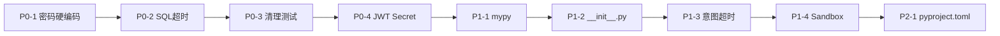

# Shopkeeper Agent — 工程改进计划

## 一、优先级与工作量

| 等级 | 数量 | 总工时估计 |
|------|------|-----------|
| P0（上线前必须修） | 4 项 | 约 2 小时 |
| P1（工程质量） | 4 项 | 约 3 小时 |
| P2（代码整洁） | 3 项 | 约 1 小时 |

---

## 二、P0：上线前必须修

### P0-1：数据库密码硬编码

**问题**：`conf/app_config.yaml:16,23` 中 `password: dili123` 明文写在 YAML 里。

**风险**：代码提交到公开仓库后，任何人都能看到数据库密码。

**改动清单**：

| 文件 | 修改内容 |
|------|---------|
| `conf/app_config.yaml` | `password: dili123` → `password: ${oc.env:DB_PASSWORD_META, dili123}` 和 `password: ${oc.env:DB_PASSWORD_DW, dili123}` |
| `.env.example` | 新增 `DB_PASSWORD_META=dili123` 和 `DB_PASSWORD_DW=dili123` |
| `.env` | 同上（如已存在） |

**测试**：启动后端，确认仍能成功连接数据库。

---

### P0-2：SQL 执行超时控制

**问题**：`app/repositories/mysql/dw/dw_mysql_repository.py:51-54` 的 `run()` 方法直接执行 SQL，LLM 可能生成全表扫描的慢 SQL，导致连接长期占用。

**改动清单**：

```python
# app/repositories/mysql/dw/dw_mysql_repository.py
# 修改 run() 方法，增加超时控制
async def run(self, sql: str, timeout: int = 30) -> list[dict]:
    # 通过 MySQL 的 max_execution_time 控制查询超时
    await self.session.execute(text(f"SET SESSION max_execution_time = {timeout * 1000}"))
    result = await self.session.execute(text(sql))
    return [dict(row) for row in result.mappings().fetchall()]
```

**测试**：执行一条故意慢的 SQL（如 `SELECT SLEEP(5)`），确认会在 30s 后超时。

---

### P0-3：清理测试文件

**问题**：`tests/` 目录下有 29 个文件，其中 18 个是临时调试文件（`debug_auth.py`、`fix_test.py`、`test_render.py` 等），面试官看到会觉得项目管理混乱。

**改动清单**：

```bash
# 删除临时调试文件（保留真正的测试）
rm tests/debug_auth.py tests/debug_auth2.py tests/debug_auth3.py
rm tests/debug_final.py tests/debug_routes.py tests/fix_test.py
rm tests/intent_test.py tests/live_test.py tests/quick_test.py
rm tests/test_all.py tests/test_api.py tests/test_chart_detect.py
rm tests/test_compare.py tests/test_llm.py tests/test_render.py
rm tests/test_render2.py tests/test_sandbox.py tests/test_session.py
rm tests/test_token.py tests/test_v2_integration.py tests/test_v2_modules.py
rm tests/test_v3.py tests/test_v3_quick.py tests/test_working.py
```

**保留**：`smoke_test.py`（冒烟测试）、`test_rag_comprehensive.py`（RAG 综合测试）、`test_rag_suite.py`（RAG 套件）、`test_sql_security.py`（SQL 安全测试）、`compare_runs.py`（对比运行）

---

### P0-4：JWT Secret 上线前必须改

**问题**：`.env.example` 和 `app_config.yaml` 都有 JWT Secret 的默认值，上线后必须使用强随机值。

**改动清单**：

| 文件 | 修改内容 |
|------|---------|
| `.env.example` | `JWT_SECRET=shopkeeper-dev-secret` → `JWT_SECRET=change-this-to-a-random-secret` |
| `conf/app_config.yaml` | 去掉默认兜底值，强制从环境变量读取 |

```yaml
# conf/app_config.yaml
auth:
  jwt_secret: ${oc.env:JWT_SECRET}  # 去掉默认值，不设置则报错
```

**测试**：不设置 `JWT_SECRET` 启动，确认服务报错而非使用默认值。

---

## 三、P1：工程质量

### P1-1：pre-commit 加类型检查

**问题**：`.pre-commit-config.yaml` 只有 `ruff`（格式检查），没有 `mypy` 或 `pyright`（类型检查）。Python 3.12 有完善的 type hint 支持，但项目没有强制校验。

**改动清单**：

| 文件 | 修改内容 |
|------|---------|
| `.pre-commit-config.yaml` | 新增 `mypy` hook |

```yaml
# .pre-commit-config.yaml 新增
  - repo: https://github.com/pre-commit/mirrors-mypy
    rev: v1.13.0
    hooks:
      - id: mypy
        args: [--strict, --ignore-missing-imports]
        files: ^app/
        language: system
```

**测试**：`pre-commit run mypy --all-files` 确认能运行。

---

### P1-2：补齐 `__init__.py`

**问题**：多个包缺少 `__init__.py`，某些工具（mypy、pytest）可能出问题。

**改动清单**：

```bash
touch app/clients/__init__.py
touch app/conf/__init__.py
touch app/core/__init__.py
touch app/entities/__init__.py
touch app/models/__init__.py
touch app/scripts/__init__.py
touch app/scripts_rag/__init__.py
touch app/services/__init__.py
```

---

### P1-3：意图分类加超时

**问题**：`app/intent/router.py` 的 LLM 调用没有独立超时。

**改动清单**：

```python
# app/intent/router.py
import asyncio

async def classify_intent(req: IntentReq):
    try:
        resp = await asyncio.wait_for(llm.ainvoke(prompt), timeout=10)
    except asyncio.TimeoutError:
        return {"intent": "sql"}  # 超时时默认走 SQL 管线
```

**测试**：模拟 LLM 超时，确认返回 `sql` 兜底。

---

### P1-4：Sandbox 安全加固

**问题**：黑名单模式只能拦截已知攻击，`exec()` 本身不安全。

**备选方案**：

| 方案 | 复杂度 | 安全性 | 说明 |
|------|--------|--------|------|
| A：强化黑名单 | 低 | 中 | 增加更多关键词，但总有绕过 |
| B：子进程隔离 | 高 | 高 | 将 Python 代码在独立子进程中执行，用 `resource` 限制 CPU/内存 |
| C：Docker 容器 | 高 | 最高 | 在 Docker 容器中执行，最安全但最重 |

**推荐**：先做方案 A（强化黑名单），后续有时间再做方案 B。

**方案 A 改动清单**：

```python
# app/report_agent/sandbox.py
# 强化 BLOCKED_KEYWORDS
BLOCKED_KEYWORDS = [
    "os", "subprocess", "sys", "eval(", "exec(", "__import__",
    "compile(", "open(", "file(", "import os", "import sys",
    "from os", "from sys", "socket", "shutil", "ctypes",
    "globals(", "locals(", "vars(", "dir(", "getattr", "setattr",
    "delattr", "execfile", "input", "__builtins__", "__class__",
    "__mro__", "__subclasses__", "__globals__",
]
```

---

## 四、P2：代码整洁

### P2-1：修复 pyproject.toml 描述

**问题**：`pyproject.toml:4` 的 `description = "Add your description here"` 是占位符。

**改动清单**：

```toml
description = "电商智能问数助手 — NL2SQL + RAG + LangGraph"
```

---

### P2-2：统一请求库风格

**问题**：前端用 `fetch`，后端测试用 `httpx`，部分代码用 `requests`。虽然没有功能性影响，但代码风格不统一。

**建议**：后端统一使用 `httpx.AsyncClient`（已在部分代码中使用）。

**改动清单**：无紧急改动，后续新代码统一使用 `httpx`。

---

### P2-3：配置拆分

**问题**：`conf/app_config.yaml` 同时包含基础配置（地址、端口）和敏感配置（密码）。

**改动清单**：

```yaml
# conf/app_config.yaml
db_meta:
  host: localhost
  port: 3307
  user: ${oc.env:DB_USER_META, didilili}
  password: ${oc.env:DB_PASSWORD_META}
  database: meta
```

```env
# .env
DB_USER_META=didilili
DB_PASSWORD_META=dili123
DB_USER_DW=didilili
DB_PASSWORD_DW=dili123
```

---

## 五、实施顺序



---

## 六、验证方式

| P0 | 验证方法 |
|----|---------|
| 密码硬编码 | 搜索代码中是否还有 `password: dili123` |
| SQL 超时 | 执行 `SELECT SLEEP(60)`，确认 30s 后超时 |
| 清理测试 | `ls tests/` 确认只剩 5 个文件 |
| JWT Secret | 不设置环境变量启动，确认服务报错 |

| P1 | 验证方法 |
|----|---------|
| mypy | `pre-commit run mypy --all-files` 通过 |
| `__init__.py` | 搜索 `app/**/` 下缺少 init 的包 |
| 意图超时 | 拉长 `timeout` 测试兜底逻辑 |
| Sandbox | 尝试注入 `os.system('dir')` 确认被拦截 |
