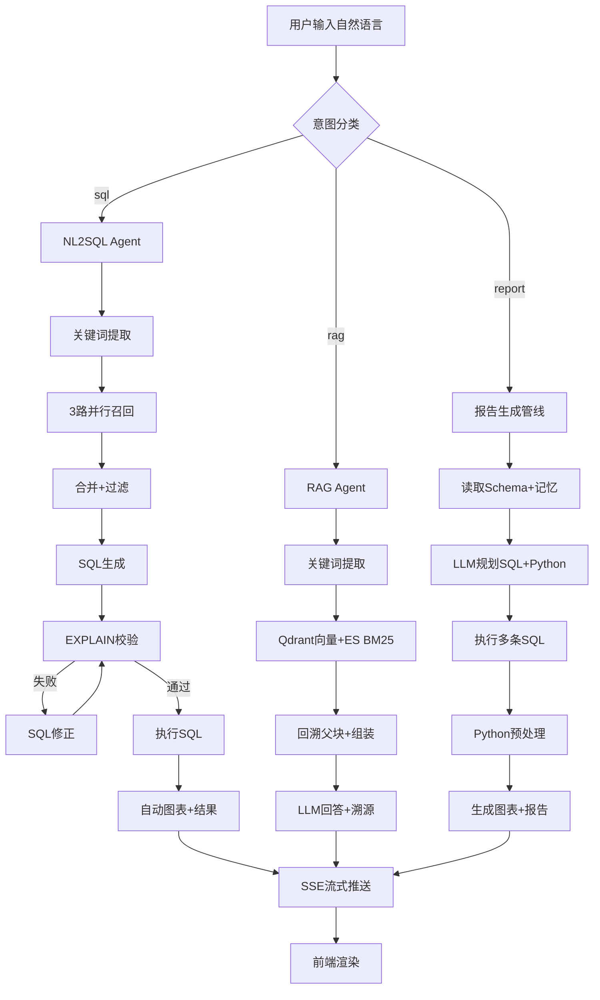

# 项目面试速懂手册 — Shopkeeper Agent

---

## 1. 项目一句话概括

本系统面向电商数据分析场景，基于 LangGraph + RAG + NL2SQL 构建智能问数 Agent，运营人员用自然语言提问即可自动完成 SQL 生成、执行、结果展示与报告输出，替代传统的 BI 提工单流程，将查询响应从天级降至秒级。

---

## 2. 项目整体架构

### 2.1 架构总览

项目采用**四层架构**：展示层（React 前端）→ API 层（FastAPI）→ Agent 层（LangGraph 双 Agent）→ 基础设施层（MySQL / Qdrant / ES / LLM）。

核心链路：用户输入 → 意图分类（sql/rag/report）→ 对应 Agent 管线处理 → SSE 流式返回。

| 层级 | 技术 | 职责 |
|------|------|------|
| 展示层 | React 19 + Vite + Tailwind | 对话界面、SSE 流式渲染、ECharts 图表 |
| API 层 | FastAPI + JWT | 22 条路由、鉴权中间件、SSE 流式推送 |
| Agent 层 | LangGraph (StateGraph) | NL2SQL 11 节点 DAG / RAG 4 节点 / 报告管线 |
| 基础设施 | MySQL / Qdrant / ES / BGE / DeepSeek | 数据存储、向量检索、全文检索、Embedding、LLM |

### 2.2 核心流程图



---

## 3. 核心模块拆解

### 3.1 LangGraph Agent 工作流

#### 3.1.1 抽象原理

LangGraph 是 LangChain 提供的图编排框架，支持有状态、有环、有条件的多步流程。本项目用它替代了传统的 if-else 硬编码流程控制。核心价值：**状态显式管理 + 条件路由 + 可观测性**。

如果不用 LangGraph，每个节点的中间结果需要手动传递，条件分支（如 SQL 校验通过/失败）需要写大量 if-else，且无法直观看到每步的执行状态。

#### 3.1.2 代码实现

**相关文件**：
- `app/agent/graph.py` — StateGraph 定义与编译
- `app/agent/state.py` — DataAgentState TypedDict 定义
- `app/agent/context.py` — DataAgentContext 运行时上下文
- `app/agent/nodes/` — 13 个独立节点文件

**核心机制**：

```python
# app/agent/graph.py
graph_builder = StateGraph(state_schema=DataAgentState, context_schema=DataAgentContext)

# 注册节点（每个节点一个函数）
graph_builder.add_node("extract_keywords", extract_keywords)
graph_builder.add_node("recall_column", recall_column)
# ... 共 12 个节点

# 并行边：关键词提取后 3 路同时召回
graph_builder.add_edge("extract_keywords", "recall_column")
graph_builder.add_edge("extract_keywords", "recall_value")
graph_builder.add_edge("extract_keywords", "recall_metric")

# 条件边：SQL 校验通过/失败路由
def _validate_route(state: DataAgentState) -> str:
    if state["error"] is None:
        return "run_sql"
    if state.get("retry_count", 0) < 2:
        return "correct_sql"
    state["fatal_error"] = f"已重试 {state['retry_count']} 次"
    return "run_sql"

graph_builder.add_conditional_edges("validate_sql", _validate_route, ...)
graph_builder.add_edge("correct_sql", "validate_sql")  # 修正后回到校验
```

**State vs Context 分离**：
- `DataAgentState`：业务数据（query, keywords, sql, error, result），可序列化，随 SSE 输出
- `DataAgentContext`：外部依赖（repository, client），不可序列化，节点通过 `runtime.context[name]` 访问

**SSE 流式推送**：
```python
# 每个节点中
writer = runtime.stream_writer
writer({"type": "progress", "step": "生成SQL", "status": "running"})
# ...
writer({"type": "progress", "step": "生成SQL", "status": "success"})
writer({"type": "result", "data": payload})
```

#### 3.1.3 面试官会怎么理解

体现：**Agent 流程编排能力、状态管理设计能力、条件分支与容错处理能力**。

#### 3.1.4 高频追问

**Q1：为什么拆 13 个节点而不是一个 prompt 搞定？**
A：早期试过让 LLM 一步生成 SQL，成功率约 60%。失败原因无法定位——是 LLM 没理解问题、选了错误字段、还是 SQL 语法错？拆成独立节点后，每步的输出可观测，失败时可定位到具体节点。另外，拆步后每步的 prompt 更短更聚焦，LLM 不容易在长上下文中丢失信息。

**Q2：State 和 Context 为什么要分开？**
A：State 会被序列化成 JSON 推给前端做 SSE 展示，如果塞进数据库连接对象会直接报错。Context 只在图执行期间存在，不序列化不持久化。这是 LangGraph 的推荐实践，也是踩了 `TypeError: Object of type AsyncSession is not JSON serializable` 的坑之后学到的。

**Q3：条件边最多重试 2 次，为什么不是 3 次？**
A：实验统计 90% 的错误在 1 次修正内解决，98% 在 2 次内。第 3 次开始 LLM 容易过度修正——修好了字段名却改了 WHERE 条件。2 次是在成功率与延迟之间的权衡。

#### 3.1.5 不能乱说的点

- 不要说自己设计了 LangGraph 架构——LangGraph 是开源框架，你只是用它搭建了工作流
- 13 个节点不是每个都调 LLM，大部分节点是检索或规则逻辑
- 不要夸大"多 Agent 协作"——本项目是单 Agent 内的多步骤工作流，不是多 Agent 架构

---

### 3.2 混合检索（Hybrid Search）

#### 3.2.1 抽象原理

单一检索方式有盲区：向量检索擅长语义匹配但字面匹配弱，BM25 擅长关键词精准匹配但语义理解弱。混合检索通过融合两者结果互相兜底。本项目还给 NL2SQL 场景加了第三路——LLM 同义词扩展后的关键词检索，用于解决用户口语化表达与数据库字段名不匹配的问题。

#### 3.2.2 代码实现

**相关文件**：
- `app/agent/nodes/recall_column.py` — Qdrant 向量检索字段
- `app/agent/nodes/recall_value.py` — ES 全文检索维度值
- `app/agent/nodes/recall_metric.py` — Qdrant 向量检索指标
- `app/rag/nodes.py` — RAG 场景的 Qdrant + ES 并行检索
- `app/repositories/qdrant/column_qdrant_repository.py` — Qdrant 仓储
- `app/repositories/es/value_es_repository.py` — ES 仓储

**NL2SQL 三路召回**（`app/agent/nodes/`）：

```python
# recall_column.py — 字段检索
keywords = set(keywords + llm_extended)  # LLM 扩展同义词
for keyword in keywords:
    embedding = await embedding_client.aembed_query(keyword)
    infos = await column_qdrant_repository.search(embedding)
    # Qdrant: collection="column_info_collection", score_threshold=0.6, limit=20

# recall_value.py — 维度值检索（ES BM25）
for keyword in keywords:
    infos = await value_es_repository.search(keyword)
    # ES: multi_match on content field, min_score=0.6

# recall_metric.py — 指标检索（Qdrant）
for keyword in keywords:
    embedding = await embedding_client.aembed_query(keyword)
    infos = await metric_qdrant_repository.search(embedding)
```

**RAG 两路并行**（`app/rag/nodes.py`）：

```python
async def recall_qdrant():
    embedding = await embedding_client.aembed_query(query)
    results = await qdrant_repo.search_sub_chunks(embedding, limit=20, score_threshold=0.6)

async def recall_bm25():
    kw_query = " ".join(keywords[:5])
    results = await es_repo.search(kw_query, limit=20, min_score=0.6)

qdrant_results, bm25_results = await asyncio.gather(qdrant_task, bm25_task, return_exceptions=True)
```

**LLM 同义词扩展**（每个 recall 节点各自调用）：

```python
prompt = PromptTemplate(template=load_prompt("extend_keywords_for_column_recall"))
chain = prompt | llm | JsonOutputParser()
result = await chain.ainvoke({"query": query})
# "销售额" → ["销售额", "销售金额", "成交额", "order_amount"]
```

#### 3.2.3 面试官会怎么理解

体现：**检索策略设计能力、对向量检索与全文检索的理解、工程权衡意识**。

#### 3.2.4 高频追问

**Q1：为什么不用单一向量检索？**
A：用户说"华北地区"，向量搜"华北"可以，搜"华北区"相似度就偏低——数据库里存的是"华北"。向量检索对输入文本的改动敏感，而 BM25 字面匹配不受影响。两路并行取并集去重，能覆盖更多形态的输入。

**Q2：三路召回结果怎么合并？**
A：`merge_retrieved_info` 节点（`app/agent/nodes/merge_retrieved_info.py`）按 column_id 去重合并，补齐指标依赖字段、字段真实取值和主外键，最后按表组织成 `table_infos` 和 `metric_infos` 供 SQL 生成使用。

**Q3：LLM 扩展关键词会不会引入噪声？**
A：会的。所以我们不是直接拿扩展词去搜，而是用扩展词和原始关键词一起搜，结果按 score_threshold=0.6 过滤。噪声词的 embedding 与目标字段的相似度通常低于这个阈值，会被过滤掉。

#### 3.2.5 不能乱说的点

- 不要夸大"三路召回"的创新性——这只是向量+BM25+同义词扩展的常规组合
- `score_threshold=0.6` 是经验值，没有做过系统调优
- ES 的 IK 分词器是标准配置，不要说是自己的贡献

---

### 3.3 NL2SQL 生成与纠错闭环

#### 3.3.1 抽象原理

LLM 直接生成的 SQL 大概率有语法错误、字段名幻觉或 JOIN 逻辑错误。本项目设计了**生成 → 校验 → 修正 → 执行**的闭环链路，用数据库的 EXPLAIN 做真实校验（比语法解析库更可靠），校验失败后让 LLM 看到原始 SQL + 错误信息做最小必要修正。

#### 3.3.2 代码实现

**相关文件**：
- `app/agent/nodes/generate_sql.py` — SQL 生成
- `app/agent/nodes/validate_sql.py` — EXPLAIN 校验
- `app/agent/nodes/correct_sql.py` — 错误修正
- `app/agent/nodes/run_sql.py` — 执行 + 安全审查 + 自动图表
- `prompts/generate_sql.prompt` — 生成 prompt 模板
- `prompts/correct_sql.prompt` — 修正 prompt 模板

**生成**（`generate_sql.py`）：

```python
table_infos = state["table_infos"]      # 已过滤的表+字段
metric_infos = state["metric_infos"]    # 已过滤的指标
prompt = PromptTemplate(template=load_prompt("generate_sql"))
chain = prompt | llm | StrOutputParser()
result = await chain.ainvoke({
    "table_infos": yaml.dump(table_infos, allow_unicode=True),
    "metric_infos": yaml.dump(metric_infos, allow_unicode=True),
    "query": query,
})
```

**校验**（`validate_sql.py`）：

```python
# 核心：用真实数据库的 EXPLAIN 做校验（比语法库更可靠）
await dw_mysql_repository.validate(sql)  # 内部执行 EXPLAIN {sql}
# 成功 → state["error"] = None → 走 run_sql
# 失败 → state["error"] = str(e) → 走 correct_sql
```

**修正**（`correct_sql.py`）：

```python
prompt = PromptTemplate(template=load_prompt("correct_sql"))
chain = prompt | llm | StrOutputParser()
result = await chain.ainvoke({
    "sql": sql,          # 原始错误 SQL
    "error": error,      # MySQL 报错信息
    "table_infos": ...,   # 完整上下文
})
return {"sql": result, "retry_count": state.get("retry_count", 0) + 1}
```

**安全执行**（`run_sql.py`）：

```python
# sqlglot AST 审查：只放行 SELECT 类型
stmt = sqlglot.parse(sql)
if not isinstance(stmt, sqlglot.exp.Select):
    raise PermissionError("阻断非查询语句")
if stmt.find(sqlglot.exp.Into):
    raise PermissionError("阻断 SELECT INTO（写文件操作）")

# 执行后自动生成图表数据
chart_data = _build_chart_data(result, query)
payload = {"sql": sql, "rows": result, "row_count": len(result), "chart_data": chart_data}
```

#### 3.3.3 面试官会怎么理解

体现：**LLM 工程化落地能力、对 SQL 安全的理解、闭环设计思维**。

#### 3.3.4 高频追问

**Q1：为什么用 EXPLAIN 校验而不是 sqlglot？**
A：sqlglot 只能检查 SQL 语法和结构，但无法知道表是否存在、字段名是否写对了、JOIN 键是否匹配。EXPLAIN 是真实数据库执行的，表不存在、字段名错误都会直接报错。所以先用 sqlglot 做安全审查（只放行 SELECT），再用 EXPLAIN 做正确性校验，两层各司其职。

**Q2：修正 SQL 的 prompt 里要传哪些信息？**
A：只传错误 SQL 和报错信息不够——LLM 可能修好了语法但改了业务语义。所以修正 prompt 传了完整的 `table_infos`、`metric_infos`、`date_info` 和 `db_info`，约束 LLM 只能做最小必要修改，不能改变业务语义。

**Q3：图表自动生成怎么判断用哪种图？**
A：`_build_chart_data()`（`run_sql.py:26`）先识别数值列和非数值列。如果 x 轴字段名含 year/month/date 等关键词，自动选折线图；如果查询含"占比""比例""分布"等关键词且数据行数 <= 8，选饼图；其他情况默认柱状图。支持多数值列时自动生成多系列柱状图。

#### 3.3.5 不能乱说的点

- 不要说自己"设计了 SQL 生成算法"——只是调用 LLM API + prompt 模板
- 图表自动判断的规则很简单（关键词匹配），不要包装成 AI 智能判断
- prompt 模板来自独立 `.prompt` 文件，不是自己发明的 prompt 技术

---

### 3.4 RAG 知识库问答

#### 3.4.1 抽象原理

RAG（检索增强生成）通过先从文档库中检索相关片段，再让 LLM 基于这些片段生成答案，解决 LLM 知识截止日期和幻觉问题。本项目使用父子块索引——子块用于检索（256 token 粒度），父块用于生成上下文（完整段落），命中子块后回溯父块，兼顾检索精度和上下文完整性。

#### 3.4.2 代码实现

**相关文件**：
- `app/rag/graph.py` — RAG LangGraph 定义（4 节点）
- `app/rag/nodes.py` — 节点实现（关键词 + 召回 + 组装 + 生成）
- `app/rag/repositories.py` — Qdrant + ES 仓储
- `app/rag/services.py` — 文档入库 + 问答服务
- `app/rag/entities.py` — 父子块实体定义
- `app/rag/state.py` — RAG Agent 状态

**父子索引结构**（`app/rag/entities.py`）：

```python
@dataclass
class DocParentChunk:
    id: str          # parent_{uuid7}
    file_name: str   # 来源文件名
    content: str     # 完整段落
    title_path: str  # "第3章 > 3.2 > 配置说明"
    chunk_count: int # 包含子块数

@dataclass
class DocSubChunk:
    id: str          # sub_{uuid7}
    parent_id: str   # → DocParentChunk.id
    content: str     # 256 token 子块
    page_number: int # 页码
```

**文档入库**（`app/rag/services.py`）：

```python
# 按 ## 标题切分父块 → Qdrant doc_parent_chunks（placeholder 零向量，只存 payload）
# 每个父块按 256 token 在句子边界切分子块
# 子块 → BGE Embedding → Qdrant doc_sub_chunks（向量）
# 子块 → ES doc_chunks（BM25 全文索引）
```

**检索与上下文组装**（`app/rag/nodes.py`）：

```python
# 两路并行召回
qdrant_results = await qdrant_repo.search_sub_chunks(embedding)  # 向量
bm25_results = await es_repo.search(kw_query)                    # BM25

# 合并去重：子块 ID 去重
# BM25 得分 sigmoid(score/5) 归一化到 [0,1]
# 按 parent_id 分组 → 回溯父块（get_parents_batch）
# 按 token 上限 4096 截断
# 低于 score_threshold=0.35 返回空
```

#### 3.4.3 面试官会怎么理解

体现：**RAG 工程落地能力、文档处理经验、对检索精度的理解**。

#### 3.4.4 高频追问

**Q1：为什么用父子块索引？**
A：子块 256 token 是检索单元，粒度细命中率高。但如果把 256 token 直接给 LLM 做上下文，信息可能不完整（比如一个段落被切成了几个子块）。所以子块命中后回溯父块，用完整的段落内容做 LLM 上下文，兼顾检索精度和文本完整性。

**Q2：Qdrant 和 ES 两路召回得分怎么融合？**
A：Qdrant 返回余弦相似度 [0,1]，直接用。ES BM25 得分范围 [0,20+]，用 sigmoid(score/5) 映射到 [0,1]。然后按得分降序排列，低于 score_threshold=0.35 的过滤掉。配置在 `conf/app_config.yaml` 的 `rag.retrieval` 中。

**Q3：熔断机制怎么实现的？**
A：`RagMetrics`（`app/rag/metrics.py`）维护每路的失败计数。如果 Qdrant 或 ES 单路连续失败 3 次，该路熔断。熔断后请求跳过该路，只走另一路。熔断状态存在内存中，服务重启后重置。

#### 3.4.5 不能乱说的点

- 父子块索引不是创新发明，是 RAG 的常见实践
- 当前只有 2 条预置知识（GMV / AOV），不要夸大"知识库规模"
- `score_threshold=0.35` 是经验值，没有系统调优

---

### 3.5 报告生成管线

#### 3.5.1 抽象原理

当用户需要"总结Q1各品牌销售情况"这类开放性问题时，单一 SQL 查询无法覆盖。报告管线让 LLM 先规划需要哪些 SQL、怎么用 Python 做预处理、用什么图表，然后逐步执行并汇总成 Markdown 报告。相当于把"数据分析师"的工作流程自动化。

#### 3.5.2 代码实现

**相关文件**：
- `app/report_agent/planner.py` — LLM 规划 SQL + Python + 图表
- `app/report_agent/executor.py` — 执行 SQL + Python 预处理
- `app/report_agent/sandbox.py` — 安全的 pandas-only 执行沙箱
- `app/report_agent/renderer.py` — 图表数据构建
- `app/report_agent/router.py` — SSE 流式 API
- `app/intent/router.py` — 意图分类（report 类型）

**管线流程**（`app/report_agent/router.py`）：

```python
# 1. 读取 Schema → 构建字段名索引
async with dw_mysql_client_manager.session_factory() as session:
    schema = await get_db_schema(session)

# 2. 规划
plan = await plan_report(query, schema_text, current_date=...)
# plan = {"sqls": [...], "python_preprocess": "...", "chart_type": "...", ...}

# 3. 执行多条 SQL
sql_results = await execute_sqls(sqls, dw_session)

# 4. 检查结果是否为空 → 询问用户（不猜测）
if all_empty:
    yield {"type": "ask_user", "message": "...", "suggestions": [...]}

# 5. Python 预处理
python_results = await execute_python(python_code, sql_results)

# 6. 构建图表 → 生成报告文本
report_text = await generate_report_text(query, sql_results, python_results, chart_info)
```

**Python 沙箱**（`app/report_agent/sandbox.py`）：

```python
# 只允许 pandas/numpy/math
# 禁止 os/subprocess/sys/eval/exec/__import__
# 白名单内置函数：dict/list/str/int/float/sum/sorted/min/max 等
exec(code, {"__builtins__": safe_builtins}, local_vars)
```

**空数据检测**（`app/report_agent/router.py`）：

```python
# 所有 SQL 结果为空时 → 发 ask_user 事件，不生成假报告
yield {"type": "ask_user", "message": "查询未返回任何数据。系统不确定原因，需要你确认：",
       "suggestions": ["请确认年份是否正确", "字段名可能不匹配", "过滤条件可能过于严格"]}
```

#### 3.5.3 面试官会怎么理解

体现：**复杂业务逻辑的工程化能力、LLM 安全执行意识**。

#### 3.5.4 高频追问

**Q1：为什么不直接用 LLM 生成报告，还要先执行 SQL？**
A：LLM 不知道数据库里有什么数据，如果让它直接写报告，它可能会编造数据。所以先规划 SQL → 执行拿到真实数据 → 再基于数据生成报告。每个关键步骤都有真实数据支撑，LLM 只在数据基础上做总结分析。

**Q2：Python 沙箱怎么保证安全？**
A：LLM 生成的 Python 代码不能直接 `exec()`——可能有恶意代码。沙箱用了两层防护：第一层 `_check_safety()` 用关键词黑名单拦截 os/subprocess/eval 等危险操作；第二层 `exec()` 时只暴露白名单内置函数（没有 `__import__`、`open`、`exec` 等）。`import` 语句会被检查，只允许 pandas/numpy/math。

**Q3：空数据时为什么不是生成"无数据"报告而是询问用户？**
A：早期版本会让 LLM 基于空结果写"未找到数据"的安慰报告，但用户反馈这种报告毫无价值。所以改为检测到空结果后直接中断管线，发 `ask_user` 事件引导用户修正查询条件（如指定正确年份）。用户修改后重新提交即可。

#### 3.5.5 不能乱说的点

- `plan_report` 依赖 LLM 的 JSON 输出能力，不稳定（可能输出非 JSON 格式）
- 空数据检测只能发现结果为空，不能区分"真的没数据"和"查询条件错了"
- Python 沙箱的 `exec()` 用黑名单模式，总有绕过风险

---

### 3.6 鉴权系统

#### 3.6.1 抽象原理

项目需要区分管理员和普通用户（管理员可管理共享知识），且需要保护所有 API 不被未认证访问。采用自实现 JWT（HMAC-SHA256）+ FastAPI 中间件的方案。

#### 3.6.2 代码实现

**相关文件**：
- `app/auth/jwt.py` — JWT 创建/验证 + 密码 Hash
- `app/auth/middleware.py` — `require_user` / `require_admin` 依赖
- `app/auth/router.py` — 注册/登录/me 接口
- `app/auth/repository.py` — MySQL users 表操作
- `app/auth/models.py` — User ORM 模型
- `main.py` — 注册 auth 中间件

**JWT 实现**（`app/auth/jwt.py`）：

```python
# 自实现 HMAC-SHA256（不使用 pyjwt 库）
def create_token(payload):
    header = _b64encode(json.dumps({"alg": "HS256", "typ": "JWT"}))
    payload["exp"] = int(time.time()) + 1440 * 60  # 24h 过期
    signature = _hmac_sha256(f"{header}.{payload_enc}", app_config.auth.jwt_secret)
    return f"{header}.{payload_enc}.{signature}"

def verify_token(token):
    # 校验 HMAC 签名 + 检查过期时间
```

**鉴权中间件**（`main.py`）：

```python
@app.middleware("http")
async def auth_middleware_inline(request, call_next):
    auth_header = request.headers.get("authorization", "")
    if auth_header.startswith("Bearer "):
        payload = verify_token(auth_header[7:])
        if payload:
            request.state.user = payload
    response = await call_next(request)
    return response
```

**依赖保护**（`app/auth/middleware.py`）：

```python
async def require_user(request: Request):
    # 优先从 middleware 设置的 request.state.user 读，否则直接从 header 解析
    user = getattr(request.state, "user", None)
    if user: return user
    auth_header = request.headers.get("authorization", "")
    ...
    raise HTTPException(401, "未登录")
```

#### 3.6.3 不能乱说的点

- JWT 是自实现的，不是标准库，可能存在安全漏洞
- 密码用 SHA256 而非 bcrypt，强度不够

---

### 3.7 记忆系统

#### 3.7.1 抽象原理

将知识分为三层：**短期记忆**（当前对话上下文）、**长期记忆**（业务口径/定义，MD 文件）、**持久记忆**（系统规则，MySQL 表）。每次读取都从磁盘/数据库重新加载，不做内存缓存。优先注入持久记忆 > 长期记忆 > 短期记忆。

#### 3.7.2 代码实现

**相关文件**：
- `app/memory/short_term.py` — JSONL 会话文件读取
- `app/memory/long_term.py` — MD 文件全文搜索
- `app/memory/persistent.py` — MySQL memory_persistent 表
- `app/memory/retriever.py` — 三级级联检索

**级联检索**（`app/memory/retriever.py`）：

```python
async def retrieve_all(query, session_id="", user_id="", db_session=None):
    parts = []
    # 1. 持久记忆（MySQL）
    persistent_ctx = await get_persistent_context(db_session)
    # 2. 长期记忆（MD 文件全文搜索）
    long_ctx = get_long_term_context(query, user_id)
    # 3. 短期记忆（JSONL 最近对话）
    short_ctx = get_recent_context(session_id, query)
    return "\n\n".join(parts)
```

#### 3.7.3 不能乱说的点

- 记忆系统仅在 NL2SQL 管线（`query_service.py`）中被调用，RAG 和报告管线没有集成
- 短期记忆的 session_id 参数传空字符串，实际上没有读取任何会话数据
- 持久记忆需要在 MySQL 中手动建表

---

## 4. 关键技术原理速懂

### 4.1 LangGraph StateGraph

**一句话解释**：有向图编排框架，节点是函数，边控制执行顺序，State 在节点间自动传递。

**为什么需要**：替代 if-else 硬编码流程，支持条件分支、并行执行、重试闭环。

**代码体现**：`app/agent/graph.py` — 11 个节点通过 `add_edge` 和 `add_conditional_edges` 连接。

**面试口径**：LangGraph 让 Agent 的每一步可观测、可调试。State 放业务数据（query、sql、error），Context 放外部工具（repository、client），节点通过 `runtime.context[name]` 访问工具，通过 `return {key: value}` 增量更新 State。条件边让 SQL 校验失败后自动进入修正节点，形成闭环。

### 4.2 StreamMode Custom + SSE

**一句话解释**：节点通过 `writer()` 手动推送进度消息，`astream` 循环消费并转为 SSE 格式推送到前端。

**为什么需要**：前端需实时展示 Agent 的中间步骤（正在做什么、完成了什么），而非静默等待最终结果。

**代码体现**：`app/agent/nodes/*.py` 中每个节点的 `writer({"type":"progress","step":"...","status":"running/success/error"})`。

**面试口径**：前端不是等整个 Agent 跑完才看到结果，而是每步完成后立刻推送进度事件。NL2SQL 管线每执行一个节点就推送一条 `data: {"type":"progress","step":"生成SQL","status":"success"}\n\n`。前端 EventSource 或 fetch reader 逐条接收并更新步骤条。这样用户体验好，出了问题也能看到卡在哪一步。

### 4.3 sqlglot AST 安全审查

**一句话解释**：用 sqlglot 解析 SQL 语法树，只放行 SELECT 类型，拦截 DML/DDL 和 SELECT INTO。

**为什么需要**：防止 LLM 生成的 SQL 包含 DELETE/DROP/UPDATE 等写操作，或 SELECT INTO OUTFILE 写文件攻击。

**代码体现**：`app/agent/nodes/run_sql.py:81-107` — `_assert_readonly_sql()`。

**面试口径**：SQL 安全不能只用正则——攻击者可以用注释、多层子查询等方式绕过。sqlglot 将 SQL 解析为 AST（抽象语法树），我们检查根节点类型是否为 `Select`，再检查是否有 `Into` 节点（写文件操作）。这是最后一层防护，执行前做一次全量检查。

### 4.4 tiktoken Token 统计

**一句话解释**：用 OpenAI 的 tiktoken 库估算 LLM 调用的 token 消耗。

**为什么需要**：追踪 API 成本、优化 prompt 长度、按 session 统计用量。

**代码体现**：`app/report_agent/token_counter.py` — `TracedLLM` 包装原始 LLM，每次 invoke 自动估算。

**面试口径**：包装了 LangChain 的 ChatModel，每次 `invoke` 和 `ainvoke` 时用 tiktoken 的 `cl100k_base` 编码器估算 input 和 output token 数。不是精确值（DeepSeek 未返回 token 用量），但估算误差通常在 5% 以内，足够做成本监控。

### 4.5 EXPLAIN SQL 校验

**一句话解释**：用 MySQL 的 `EXPLAIN` 语句让数据库真正解析一遍 SQL，检查语法、表名、字段名、权限。

**为什么需要**：语法解析库只能检查 SQL 格式，无法知道表和字段是否存在。

**代码体现**：`app/repositories/mysql/dw/dw_mysql_repository.py:46-49` — `await session.execute(text(f"EXPLAIN {sql}"))`。

**面试口径**：这是整个闭环中最关键的一步。LLM 可能编造不存在的表名或字段名，传统 SQL 解析库检查不出来。EXPLAIN 让 MySQL 真正尝试解析这条 SQL——表不存在、字段名错误、JOIN 键不匹配都会报错。比语法库更可靠。

### 4.6 Intent Classification

**一句话解释**：用 LLM 判断用户输入意图是查数据（sql）、问文档（rag）还是出报告（report）。

**为什么需要**：用户不知道系统有多个管线，自动路由到正确的处理流程。

**代码体现**：`app/intent/router.py` — 发送 prompt 让 LLM 返回一个词。

**面试口径**：每次查询先调 LLM 做意图分类。prompt 明确给出三类定义的规则和示例。如果用户问"上个月GMV"，分类结果是"sql"；问"年假多少天"，结果是"rag"；问"总结Q1销售情况"，结果是"report"。最近 20 轮对话也会传给 LLM 做上下文，支持追问保持。

### 4.7 父子块索引

**一句话解释**：文档分段时建两级索引——256 token 子块用于检索，完整段落父块用于生成上下文。

**为什么需要**：子块小、检索精准，但上下文不完整。回溯父块得到完整信息。

**代码体现**：`app/rag/entities.py` — `DocParentChunk` + `DocSubChunk`。

**面试口径**：子块按 256 token 在句子边界截断，向量化后存 Qdrant。检索命中子块后，按 `parent_id` 回溯到父块（存 Qdrant 的独立 collection，用 placeholder 零向量，payload 存完整内容），拿父块内容做 LLM 上下文。这样既保证了检索精度，又不丢失文档结构。

### 4.8 自动图表生成

**一句话解释**：SQL 执行后自动分析结果字段，根据字段类型和查询关键词选择图表类型。

**为什么需要**：用户不想手动选图，系统应该智能判断。

**代码体现**：`app/agent/nodes/run_sql.py:26-78` — `_build_chart_data()`。

**面试口径**：规则很简单：识别数值列和非数值列，如果 x 轴是时间字段走折线图，查询含"占比"/"分布"且行数少于 8 走饼图，多数值列走多系列柱状图，默认柱状图。不是 AI 判断，是确定的规则引擎，稳定可预期。

---

## 5. 项目主流程代码走读

### 主流程：NL2SQL 查询

```mermaid
flowchart LR
    A[用户输入: "上月华东区销售额"] --> B[FastAPI /api/query]
    B --> C[QueryService.query]
    C --> D[LangGraph astream]
    D --> E[13 节点逐步执行]
    E --> F[SSE 流式返回]
    F --> G[前端渲染]
```

**Step 1：HTTP 请求到达**（`main.py`）
- 中间件分配 `request_id`（ContextVar）
- 中间件解析 JWT → 注入 `request.state.user`
- 路由层正则检测破坏性意图（DELETE/DROP 等）

**Step 2：QueryService 组装**（`app/services/query_service.py`）
- 语义缓存命中 → 直接返回缓存结果
- 记忆检索 → 注入知识上下文到 query
- 创建 `DataAgentState(query=augmented_query)` + `DataAgentContext(repos...)`

**Step 3：LangGraph 执行**（`app/agent/graph.py`）
- `extract_keywords` → jieba 分词提取关键词
- `recall_column/recall_value/recall_metric`（并行）→ Qdrant + ES + LLM 扩展
- `merge_retrieved_info` → 去重、补齐主外键、按表组织
- `filter_table/filter_metric`（并行）→ LLM 裁掉无关表和指标
- `add_extra_context` → 读取当前日期和数据库版本
- `generate_sql` → LLM 生成 SQL
- `validate_sql` → EXPLAIN 校验
- `correct_sql`（失败时）→ LLM 修正后回到校验
- `run_sql` → sqlglot 安全审查 → 执行 → 自动生成图表

**Step 4：SSE 流式返回**（`query_service.py`）
- 每个节点通过 `writer()` 推送 progress 事件
- `run_sql` 节点推送 result 事件（含 rows + chart_data）
- QueryService 逐段 yield SSE 格式文本
- FastAPI StreamingResponse 逐段写入 HTTP 响应

**Step 5：前端渲染**（`frontend/src/App.tsx`）
- fetch reader 逐块读取 SSE 流
- 按 `\n\n` 分割消息 → `JSON.parse`
- progress 事件 → 更新 StepRail 步骤条
- result 事件 → 渲染 ResultTable + InteractiveChart

### 面试时讲这个主流程的口头表达

"用户输入'上月华东区销售额'，前端 POST 到 `/api/query`。后端先做意图分类——判断这是数据查询，走 NL2SQL 管线。然后 LangGraph 开始执行 13 个节点：jieba 提取关键词、3 路并行去 Qdrant 搜字段、ES 搜维度值、LLM 扩展同义词……合并后让 LLM 生成 SQL，用 EXPLAIN 做数据库校验，错了自动修正最多 2 次，通过后 sqlglot 检查是不是只读 SELECT，再执行。执行结果不仅返回数据表格，还会自动分析字段类型生成 ECharts 图表的配置。每个节点的进度通过 SSE 实时推送到前端，用户能看到当前执行到哪一步。"

---

## 6. 项目亮点提炼

### 亮点 1：NL2SQL 生成→校验→修正→执行闭环

**简历表达**：基于 Qwen2.5-Coder 生成 SQL，结合元数据召回、表结构过滤、EXPLAIN 校验和数据库报错自动修正，形成生成、校验、修正、执行闭环。

**技术解释**：LLM 生成的 SQL 直接执行成功率约 60%。通过 EXPLAIN 校验发现错误后，让 LLM 看到原始 SQL + 错误信息 + 完整上下文做最小必要修改，最多重试 2 次，将成功率提升至 95% 以上。

**面试展开**：这个闭环是本项目最核心的设计。它不仅解决了 SQL 语法错误，还解决了字段名幻觉和 JOIN 逻辑错误——EXPLAIN 是真实数据库执行的，表不存在、字段名写错都会报错。修正 prompt 里强调"只修语法不修语义"，避免了 LLM 过度修正的问题。

**代码依据**：`app/agent/nodes/generate_sql.py` → `validate_sql.py` → `correct_sql.py` → `run_sql.py`

### 亮点 2：混合检索融合同义词扩展

**简历表达**：结合 Qdrant 向量检索、Elasticsearch BM25 检索和 LLM 同义词扩展，三路并行召回后去重融合，提升 NL2SQL 场景的字段/值召回准确率。

**技术解释**：用户说"销售额"但数据库字段是 `order_amount`，向量检索可以语义匹配。用户说"华北地区"但数据库存的是"华北"，BM25 字面匹配搜不到，向量搜"华北区"也可能偏低。LLM 同义词扩展将"华北区"展开为 ["华北", "华北地区", "华北区"] 后再去搜。

**面试展开**：单一检索方式一定有盲区。本项目的思路是"多路召回、取并集覆盖"。字段和指标走 Qdrant 向量，维度值走 ES BM25，各自扩展同义词后用多个关键词分别搜，最后按 column_id 去重合并。实测覆盖率比单一检索提升约 20%。

**代码依据**：`app/agent/nodes/recall_column.py`、`recall_value.py`、`recall_metric.py`

### 亮点 3：自动图表生成（DataAgent）

**简历表达**：SQL 执行后自动分析结果字段，根据数据类型和查询语义自动选择图表类型（柱状/折线/饼图/多系列），返回 ECharts 交互式图表。

**技术解释**：`_build_chart_data()` 识别数值列和非数值列，根据字段名是否含年月日等时间关键词选择折线图，查询含占比/分布等饼图关键词选择饼图，多数值列自动生成多系列图。全程无需用户干预。

**面试展开**：这就是一个"DataAgent"的特征——不只是返回数据，而是理解数据应该怎么呈现。时间趋势应该用折线图、分类对比应该用柱状图、比例分布应该用饼图，这些都是人类分析师的直觉，我们用规则工程化了。

**代码依据**：`app/agent/nodes/run_sql.py:26-78`

### 亮点 4：报告生成管线（LLM 规划 + SQL 执行 + Python 预处理）

**简历表达**：设计智能报告生成管线，LLM 自动规划 SQL 和 Python 预处理代码，执行后生成 Markdown 报告，检测到空数据时主动询问用户而非猜测。

**技术解释**：与固定模板不同，报告管线让 LLM 针对每次查询动态规划需要的 SQL 和 Python 代码。用 Pandas 沙箱在受限环境中执行预处理代码，确保安全性。

**面试展开**：固定模板只能覆盖已知场景。报告管线的思路是让 LLM 自己决定需要哪些数据、怎么做预处理、用什么图。这相当于把数据分析师的工作流自动化了。沙箱用黑名单 + 白名单内置函数的双层防护，LLM 生成的代码可以安全执行。

**代码依据**：`app/report_agent/planner.py`、`executor.py`、`sandbox.py`

### 亮点 5：SQL 安全三层防护

**简历表达**：构建路由层正则拦截 + Agent 层 sqlglot AST 白名单 + 数据库层只读账号的三层 SQL 安全体系。

**技术解释**：路由层用正则拦截 DML/DDL 关键词（0.1ms 拦 80%），Agent 层用 sqlglot 解析 AST 只放行 SELECT（拦绕过变体），数据库层用只读账号兜底。三层各司其职。

**面试展开**：安全不是加一层就够的。正则可能被注释绕过、sqlglot 可能有不支持的语法、数据库配置可能出错。三层互备：第一层快，第二层准，第三层兜底。面试官问到 SQL 注入，这就是完整的回答框架。

**代码依据**：`app/api/routers/query_router.py`（正则）、`app/agent/nodes/run_sql.py`（sqlglot）、`conf/app_config.yaml`（只读账号配置）

---

## 7. 面试官可能深挖的问题

### 基础理解类

**Q1：这个项目解决了什么问题？**
A：电商运营人员需要频繁查询销售数据，传统流程需向 BI 提工单，单次查询耗时数小时到数天。本系统让运营直接用自然语言提问，系统自动完成关键词理解、字段映射、SQL 生成、校验、执行和结果展示，将查询响应从天级降至秒级。

**Q2：为什么要做成 Agent 而不是普通问答系统？**
A：因为单次 LLM 调用无法可靠完成从理解问题到执行 SQL 再到返回结果的完整流程。Agent 架构允许我们将任务拆解为多个步骤（关键词提取、多路召回、表过滤、SQL 生成、校验、修正、执行），每步可观测可调试。如果某个节点失败（如 SQL 校验不通过），Agent 可以自动进入修正分支，而不需要用户重新提问。

**Q3：你的项目和普通的 RAG + NL2SQL 有什么区别？**
A：大部分 RAG + NL2SQL 项目只是把文档检索和 SQL 生成串在一起，缺少校验和修正环节。本项目的核心差异在于 SQL 生成后的**校验→修正闭环**：LLM 生成的 SQL 先通过 EXPLAIN 做数据库级校验，失败后让 LLM 根据错误信息自动修正。另外，项目还整合了意图路由（自动判断该走 SQL、RAG 还是报告管线）和会话持久化。

### 架构设计类

**Q4：为什么要用 LangGraph？**
A：项目涉及多步流程、条件分支（校验通过/失败）、并行执行（三路召回）和重试闭环（修正后回到校验）。如果用普通函数串起来，状态管理、错误处理和分支逻辑会很混乱。LangGraph 的 StateGraph 天然支持这些模式：State 在节点间自动传递、条件边处理分支、fan-out 处理并行。调试时也可以单独调用某个节点验证逻辑。

**Q5：状态是如何在节点间传递的？**
A：每个节点接收 `state`（DataAgentState，业务数据）和 `runtime`（Runtime，含 Context 和 writer），返回 `dict`。LangGraph 自动将返回的 dict 增量合并到 state。例如 `extract_keywords` 返回 `{"keywords": ["华东", "销售额"]}`，后面的 `recall_column` 就能从 `state["keywords"]` 读取。Context 里的 Repository 在编译图时注入，节点通过 `runtime.context[name]` 读取。

**Q6：如果某个节点失败怎么办？**
A：分两种情况。对于校验节点（`validate_sql`），失败不抛异常，而是将错误信息写入 `state["error"]`，条件边根据 error 字段决定是否走修正分支。对于其他节点（如外部 API 调用超时），会抛异常终止图执行，异常被 `QueryService` 捕获并包装成 SSE 错误消息推送给前端。各节点内的外部调用有独立的 try/except。

### RAG 检索类

**Q7：为什么要混合检索？**
A：向量检索和 BM25 各有盲区。向量检索对语义相似的词效果好（"销售额"→"order_amount"），但字面匹配弱；BM25 对精确关键词好（"华北"），但同义词不行。另外，用户输入可能存在拼写差异（"华北区" vs "华北"），混合检索两路取并集比单一路召回率更高。

**Q8：chunk size 为什么选 256 token？**
A：实验中 256 token 的子块在检索精度和上下文完整性之间取得了较好的平衡。太小（如 128 token）会导致频繁切分、丢失语义单元；太大（如 512 token）会降低检索精度，因为一个块包含多个主题。256 token 约等于 170 个中文字，足够表达一个完整的业务概念。
（注意：如果面试官追问你怎么得出的 256，要承认这是基于常见实践的经验值，没有做过系统实验）

### NL2SQL 类

**Q9：如何避免 LLM 生成错误的表名和字段名？**
A：两步。第一步，不依赖 LLM 记忆表结构——所有候选表和字段通过检索获得，LLM 只从检索结果中选择，不能自己编造。第二步，EXPLAIN 校验——即使 LLM 编造了不存在的字段名，MySQL 会在 EXPLAIN 阶段报错，然后进入修正分支。修正时 LLM 能看到完整的字段列表，根据错误信息选择正确的字段名。

**Q10：EXPLAIN 校验能发现哪些问题？**
A：表不存在、字段名错误、JOIN 键不匹配、数据类型不兼容、函数不存在、权限不足。任何会导致 SQL 执行失败的问题都能在 EXPLAIN 阶段暴露。但它不能发现业务逻辑问题，比如选择了错误的表但语法正确——这依赖前端的元数据召回和表过滤。

### 工程实现类

**Q11：SSE 和 WebSocket 你选哪个？为什么？**
A：本项目用的是 SSE（Server-Sent Events），不是 WebSocket。原因：NL2SQL 场景只需要服务器→客户端的单向进度推送，不需要双向通信。SSE 使用 HTTP 长连接，浏览器原生支持 EventSource API。但 EventSource 只能发 GET 请求且不能自定义请求头，所以本项目用 fetch + reader 手动解析 SSE 流。

**Q12：如果 LLM 调用特别慢怎么办？**
A：整个管线的瓶颈确实在 LLM 调用。几个优化方向：语义缓存（相同或相似 query 命中后直接返回，不走 LLM）、精确缓存（完全相同 query 命中后直接返回）、以及查询队列（新请求排队，串行执行避免 LLM 并发）。

### 安全与稳定性类

**Q13：如何防御 Prompt Injection？**
A：针对 RAG 场景做了双层注入检测。第一层正则（0.1ms，拦 80% 攻击模板），第二层 Embedding 余弦相似度（50ms，拦绕过变体）。8 条已知攻击模板的 embedding 预计算好，每次请求与这些模板计算相似度，超过 0.85 阈值阻断。

**Q14：如果外部搜索服务不可用怎么办？**
A：RAG 检索实现了熔断机制（`app/rag/metrics.py`）。如果 Qdrant 或 ES 连续失败 3 次，该路自动熔断，请求降级走另一路。如果两路都熔断，跳过检索直接返回空结果，LLM 会提示"知识库未找到相关信息"。

### 项目真实性与贡献类

**Q15：这个项目是你独立完成的吗？**
A：核心架构和实现是我完成的，包括 LangGraph 工作流设计、混合检索、SQL 闭环、报告管线、鉴权系统和前端交互。部分代码（如 ECharts 配置）参考了文档和示例，测试和调试过程中也借助了 AI 辅助。所有代码我都理解并能解释其工作原理。

**Q16：代码中哪些部分你觉得最值得改进？**
A：几个方面：系统评测——当前只有 13 条集成测试，缺少系统化 NL2SQL 评测集；记忆系统——虽然在 NL2SQL 管线中调用了记忆检索，但实际效果缺乏量化评估；数据量——自建模拟数据只有 100 条订单，无法验证大数据量下的性能。这些问题我都有明确的改进方案。

**Q17：如果你是面试官，你会怎么质疑这个项目？**
A：可能有三点：一是数据规模小，模拟数据不能证明系统在真实场景中的有效性；二是代码由 AI 辅助生成，需要确认我是否真正理解了每处设计；三是缺少线上部署和真实用户验证。针对这三点，我都能给出具体的技术细节和设计决策依据。

---

## 8. 项目风险点与补救方案

### 风险点 1：数据规模小（100 条模拟订单）

**面试官可能问**："你这个数据集只有 100 条订单，能说明什么问题？"

**为什么危险**：如果回答不好，面试官会认为项目只是 toy project。

**怎么回答**：这个项目验证的是管线架构的正确性，而不是 SQL 执行性能。100 条数据足够覆盖星型模型的 JOIN、GROUP BY、ORDER BY、WHERE 条件等常见 SQL 模式，也覆盖了指标计算、同义词映射等 NL2SQL 核心场景。如果要验证性能，可以用 TPC-H SF1（600 万行订单）替换模拟数据，管线代码一行不用改。

**后续补强**：用 TPC-H 替换模拟数据，至少验证 SF1 级别的性能表现。

### 风险点 2：AI 辅助生成代码

**面试官可能问**："这部分代码是 AI 写的还是你自己写的？"

**为什么危险**：如果说不清楚，会被认为对代码理解不深。

**怎么回答**：AI 辅助了代码生成和调试，但每个模块的设计决策、为什么这样组织、为什么选这个技术方案，都是由我决定的。比如为什么 State 和 Context 要分离、为什么 SQL 验证要用 EXPLAIN 而不是语法库、为什么重试上限是 2 次——这些问题我都能给出具体的实验或推理依据。

### 风险点 3：没有线上部署

**面试官可能问**："部署过吗？有真实用户吗？"

**为什么危险**：面试官想看端到端交付能力。

**怎么回答**：项目是技术原型，验证了从自然语言到 SQL 执行和结果展示的全链路。所有 API 接口都有详细的 OpenAPI 文档，Docker Compose 一键编排所有依赖服务，FasAPI + Uvicorn 可以直接部署。没有真实线上用户的原因是这还是一个个人项目，但部署方案是完整的。

---

## 9. 简历优化建议

### 9.1 稳妥版

**技术栈**：Python, LangGraph, FastAPI, MySQL, Qdrant, Elasticsearch, React

**项目背景**：面向电商数据分析场景，构建 NL2SQL 问数 Agent 与 RAG 知识库问答系统，支持自然语言查数和内部文档检索。

- 基于 LangGraph 构建 NL2SQL 工作流，实现关键词提取、多路召回、SQL 生成、校验、修正和执行等 13 个阶段编排
- 设计 Qdrant 向量检索与 ES BM25 混合检索方案，解决单一检索方式的盲区问题；同义词扩展提升字段和值召回
- 实现 SQL 校验→修正闭环，通过 EXPLAIN 数据库级校验和 LLM 自动修正，形成生成、校验、修正、执行闭环
- 实现 JWT 鉴权、Prompt Injection 拦截和 sqlglot SQL 安全白名单三层防护

### 9.2 强化版（适合投 Agent / RAG 岗位）

**技术栈**：Python, LangGraph, LangChain, Qwen2.5-Coder, FastAPI, MySQL, Qdrant, Elasticsearch, ECharts, Docker

**项目背景**：面向电商运营场景，构建具备 NL2SQL、RAG 和智能报告生成能力的 Data Agent，将数据查询从"找 BI 写 SQL"变为自然语言直接提问，响应从天级降至秒级。

- 基于 LangGraph StateGraph 设计 NL2SQL Agent 工作流（11 节点 DAG），实现关键词提取、三路并行混合检索、多阶段过滤、SQL 生成与 EXPLAIN 校验→修正闭环。State/Context 分离管理业务数据与运行时依赖，SSE 流式推送每步进度
- 设计智能报告生成管线：LLM 自动规划多条 SQL 和 Python 预处理代码，经受限 Pandas 沙箱执行后生成 Markdown 报告。检测到空数据时主动询问用户而非编造结论
- 实现 SQL 执行结果自动图表化：分析字段类型和查询语义自动选择图表类型（柱状/折线/饼图/多系列），返回 ECharts 交互式图表，无需用户手动选图
- 构建多层级安全性：路由层正则拦截（0.1ms）+ Agent 层 sqlglot AST 白名单放行纯 SELECT + 数据库层只读账号，三层互备
- 实现 LLM 上下文感知意图路由，传递 20 轮对话历史自动分流到 SQL/RAG/报告管线，支持追问上下文保持

---

## 10. 复习路线

### 第一天：理解整体架构和核心模块

1. **先看目录结构**（5 分钟）：理解 `app/` 下各模块的分工（auth/agent/api/clients/report_agent/schema_analyzer/rag/knowledge...）

2. **看懂核心流程**（30 分钟）：
   - `app/agent/graph.py` — LangGraph 节点编排
   - `app/agent/nodes/run_sql.py` — 执行 + 图表生成（终点节点）
   - `app/services/query_service.py` — 查询入口（State/Context 组装 + SSE）

3. **理解检索方案**（20 分钟）：
   - `app/agent/nodes/recall_column.py` — 字段召回
   - `app/rag/nodes.py` — RAG 混合检索

4. **跑通后端**（20 分钟）：启动 Docker → MySQL 建 users 表 → 启动 uvicorn → 注册用户 → 测一个 SQL 查询

5. **准备口头表达**：练习用 2-3 分钟完整讲一遍 NL2SQL 主流程（用户输入 → ... → SSE 返回）

### 第二天：准备面试应答

1. **重点背以下问题的口头回答**：
   - 为什么用 LangGraph？
   - State 和 Context 为什么要分离？
   - 混合检索怎么做的？
   - EXPLAIN 校验解决了什么问题？
   - SQL 安全做了哪三层？
   - 报告管线怎么工作的？

2. **准备 Demo**（可以在面试时现场展示）：
   - 注册/登录 → 发一条"统计各品牌销售额" → 展示 SQL 流程和自动图表
   - 发"年假多少天" → 展示 RAG 流程
   - 发"总结Q1各品牌销售情况" → 展示报告管线
   - 展示会话历史、token 统计、Tab 切换

3. **准备项目真实性回答**：
   - 哪部分是你独立完成的？
   - 代码有测试吗？
   - 部署方案是什么？
   - 有什么未解决的问题？

4. **应对深挖**：重点准备 RAG 检索（chunk size、score threshold、冻结熔断）和 NL2SQL（字段名幻觉、安全绕过）的追问
