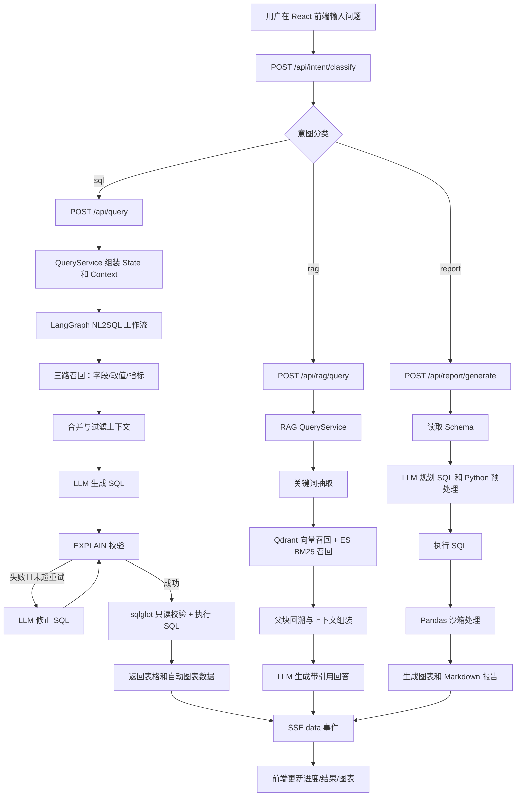

# 项目面试速懂手册

> 项目：`shopkeeper-agent-main`  
> 代码依据：`README.md`、`main.py`、`conf/`、`app/`、`frontend/src/`、`docker/docker-compose.yaml`、`tests/`。  
> 重要提醒：本文只按当前代码实现整理。代码里没有完整实现的能力，会明确标注，面试时不要夸大。

---

## 1. 项目一句话概括

本项目面向电商经营分析场景，基于 FastAPI、LangGraph、RAG 与 NL2SQL 构建智能问数系统，支持自然语言查数、知识库问答、SQL 校验纠错与结果可视化。

---

## 2. 项目整体架构

### 2.1 架构总览

项目是一个“前端对话界面 + FastAPI 后端 + LangGraph Agent + 元数据知识库 + RAG 知识库”的工程化原型。

- **前端层**：`frontend/src/App.tsx` 是主界面；`agentApi.ts` 和 `ragApi.ts` 用 `fetch` 调后端并解析 SSE；`MessageBubble.tsx` 展示结果表、图表和来源；`StepRail.tsx` 展示 SQL/RAG/报告不同流程图。
- **API 层**：`main.py` 注册 router，并用中间件注入 `request_id` 和用户上下文；`query_router.py` 暴露 `/api/query`；`rag_query_router.py` 暴露 `/api/rag/query` 和 `/api/rag/upload`；`report_agent/router.py` 暴露 `/api/report/generate`；`schema_analyzer/router.py` 暴露 `/api/schema` 和 `/api/viz/generate`。
- **依赖组装层**：`app/api/dependencies.py` 用 FastAPI `Depends` 创建请求级 Session、Repository 和 `QueryService`；`app/api/lifespan.py` 在应用启动时初始化 MySQL、Qdrant、Elasticsearch、Embedding 客户端。
- **NL2SQL Agent 层**：`app/agent/graph.py` 用 LangGraph 编排关键词抽取、字段召回、取值召回、指标召回、上下文补全、SQL 生成、校验、修正、执行等节点。
- **RAG 层**：`app/rag/services.py` 负责文档入库，`app/rag/graph.py` 和 `app/rag/nodes.py` 负责知识库问答；检索采用 Qdrant 向量检索 + Elasticsearch BM25。
- **元数据构建层**：`app/scripts/build_meta_knowledge.py` 是元数据同步脚本入口，`app/services/meta_knowledge_service.py` 读取 `conf/meta_config.yaml`，把表、字段、指标写入 MySQL、Qdrant 和 ES。
- **基础设施层**：`docker/docker-compose.yaml` 编排 MySQL、Qdrant、Elasticsearch、Kibana、Embedding 服务。端口已改为 MySQL `3307`、Qdrant `18933`、Kibana `5602`，避免和本机默认端口冲突。
- **模型层**：`app/agent/llm.py` 通过 `init_chat_model(..., model_provider="openai")` 调兼容 OpenAI 协议的大模型，配置来自 `conf/app_config.yaml` 的 `llm.base_url`、`llm.model_name`、`LLM_API_KEY`。

**边界说明**：当前仓库没有发现完整 LoRA/SFT 训练脚本，也没有本地 Qwen2.5-Coder 推理服务接入代码。简历可以说“预留 OpenAI 兼容模型接口，理论上可替换为自部署 SFT 模型”，但不能说“本仓库完成了 LoRA 微调闭环”。

### 2.2 核心流程图



---

## 3. 核心模块拆解

### 3.1 FastAPI 接口与依赖注入

#### 3.1.1 抽象原理

API 层负责把 HTTP 请求变成后端服务调用。它不应该直接写 SQL、直接操作 Qdrant，也不应该直接创建复杂对象。这样做的好处是接口函数保持很薄，真正的业务逻辑集中在 Service 和 Agent 中，后续换数据库、换检索实现时不会影响路由层。

在本项目中，`Depends` 不是“从 JSON 里提取所有东西”，而是 FastAPI 的依赖注入机制：它根据函数参数声明，自动创建 Session、Repository、Service。用户请求体只提供 `query`，其他依赖来自应用启动时初始化的 client manager。

#### 3.1.2 代码实现

相关文件：

- `main.py`
- `app/api/lifespan.py`
- `app/api/dependencies.py`
- `app/api/routers/query_router.py`
- `app/auth/router.py`
- `app/auth/middleware.py`

核心实现：

- `main.py`：创建 `FastAPI(lifespan=lifespan)`，注册 query、rag、report、schema、session、auth 等 router；中间件把 JWT payload 写入 `request.state.user` 和 `user_ctx_var`，把请求 ID 写入 `request_id_ctx_var`。
- `lifespan()`：服务启动时初始化 `qdrant_client_manager`、`embedding_client_manager`、`es_client_manager`、`meta_mysql_client_manager`、`dw_mysql_client_manager`，关闭时释放连接。
- `get_meta_session()` / `get_dw_session()`：每个请求创建一次 SQLAlchemy `AsyncSession`，请求结束自动退出。
- `get_query_service()`：把 `MetaMySQLRepository`、`DWMySQLRepository`、`ColumnQdrantRepository`、`MetricQdrantRepository`、`ValueESRepository`、Embedding client 注入 `QueryService`。
- `query_handler()`：接收 `QuerySchema`，做简单频率限制和破坏性 SQL 意图正则拦截，然后返回 `StreamingResponse(query_service.query(...), media_type="text/event-stream")`。

#### 3.1.3 面试官会怎么理解

这个模块体现的是后端工程基本功：路由、依赖注入、连接生命周期、鉴权中间件、SSE 响应组织。面试官会关注你是否理解“请求体、依赖对象、连接资源”三者的区别。

#### 3.1.4 高频追问与回答

**问题 1：Depends 是怎么把 QueryService 组装出来的？**  
回答：前端只传 JSON，比如 `{query: "统计各大区销售额"}`。FastAPI 先把它解析成 `QuerySchema`，然后看到参数里有 `Depends(get_query_service)`，就递归调用依赖函数。`get_query_service` 又依赖 MySQL Session、Repository、Embedding client 等对象，这些对象来自 `app/api/dependencies.py`。所以 Depends 不是从请求体里拿 Repository，而是按函数声明自动创建后端运行时依赖。

**问题 2：为什么客户端连接放在 lifespan，而不是每个请求创建？**  
回答：MySQL engine、Qdrant client、ES client、Embedding client 都是外部资源，频繁创建会增加连接成本，也容易造成资源泄漏。项目在 `app/api/lifespan.py` 中启动时初始化一次，依赖函数只从 manager 里取已初始化对象。请求级别只创建数据库 Session，这样既复用底层连接池，又保证一次请求内事务边界清晰。

**问题 3：SSE 为什么用 StreamingResponse？**  
回答：NL2SQL 和 RAG 都不是立即返回结果的接口，中间有多个节点。`StreamingResponse` 可以边执行边把 `data: {...}\n\n` 推给前端，前端实时展示“抽取关键词、召回字段、生成 SQL”等进度。这里不需要 WebSocket 的双向通信，所以 SSE 更简单，且能复用 HTTP。

#### 3.1.5 不能乱说的点

- 不要说所有接口都有严格鉴权。`/api/query` 读取 `user_ctx_var`，但没有强制 `Depends(require_user)`；`/api/reports/*`、部分 memory 接口才使用 `require_user`。
- 不要说有分布式限流。`app/cache/services.py` 的 rate limiter 是内存字典，单进程有效，不能跨多实例。
- 不要说已经生产级部署。当前是 Docker Compose + Uvicorn 开发运行方式，缺少 Nginx、HTTPS、进程守护、监控告警等上线配置。

---

### 3.2 元数据知识库构建

#### 3.2.1 抽象原理

NL2SQL 最大的问题不是“模型不会写 SQL”，而是模型不知道业务库里到底有哪些表、字段、指标口径和值。元数据知识库就是把这些信息提前结构化，并建立可检索索引，让 Agent 生成 SQL 前先检索真实上下文，而不是让模型凭空猜。

不用这层会出现三个问题：表名字段名幻觉、指标口径不一致、WHERE 条件里的枚举值不匹配。

#### 3.2.2 代码实现

相关文件：

- `conf/app_config.yaml`
- `conf/meta_config.yaml`
- `app/conf/meta_config.py`
- `app/scripts/build_meta_knowledge.py`
- `app/services/meta_knowledge_service.py`
- `app/entities/*.py`
- `app/models/*.py`
- `app/repositories/mysql/meta/*.py`
- `app/repositories/qdrant/*.py`
- `app/repositories/es/value_es_repository.py`

核心流程：

1. `conf/meta_config.yaml` 描述要同步的表、字段、字段别名、字段描述、指标和指标相关字段；`sync: true` 表示这个字段的真实取值要写入 ES，用于用户说“华北、黄金会员、手机”等枚举值时检索。
2. `build_meta_knowledge.py` 初始化 MySQL、Qdrant、ES、Embedding 客户端，创建 Repository，再调用 `MetaKnowledgeService.build(config_path)`。
3. `MetaKnowledgeService._save_tables_to_meta_db()` 把配置中的表字段转成 `TableInfo` / `ColumnInfo` 实体；字段类型和示例值不从配置写死，而是通过 `DWMySQLRepository.get_column_types()`、`get_column_values()` 从真实 DW 库查询。
4. `MetaMySQLRepository.save_table_infos()`、`save_column_infos()` 把实体通过 Mapper 转成 SQLAlchemy ORM 模型，再 `session.add_all()` 等待事务提交。
5. `_save_column_info_to_qdrant()` 把字段名、字段描述、字段别名分别向量化，写入 Qdrant 的 `column_info_collection`。
6. `_save_value_info_to_es()` 把 `sync: true` 的字段真实取值写入 Elasticsearch `value_index`。
7. `_save_metrics_to_meta_db()` 和 `_save_metrics_to_qdrant()` 保存指标信息和指标字段关系，并建立指标向量索引。

实体、ORM、Repository 的关系：

- **实体**：`app/entities/column_info.py`，业务内部通用对象，不绑定数据库。
- **ORM 模型**：`app/models/column_info.py`，MySQL 表结构映射，给 SQLAlchemy 用。
- **Mapper**：`app/repositories/mysql/meta/mappers/*`，负责实体和 ORM 互转。
- **Repository**：封装“如何读写某个存储”，例如 `MetaMySQLRepository` 管 MySQL 元数据库，`ColumnQdrantRepository` 管字段向量库。
- **Service**：编排完整流程，决定“先查 DW、再写 Meta MySQL、再写 Qdrant、再写 ES”。

#### 3.2.3 面试官会怎么理解

这个模块体现的是你对 NL2SQL 前置知识准备的理解，也体现工程分层能力。你能讲清楚配置、实体、ORM、Repository、Service 的区别，面试官会认为你不是只会跑脚本，而是理解项目结构。

#### 3.2.4 高频追问与回答

**问题 1：为什么不直接让模型读取 meta_config.yaml？**  
回答：配置文件只是同步清单，主要有人维护的业务语义，比如字段描述、别名、是否同步字段值。字段类型、示例值、真实取值这些信息来自数据库运行时查询。如果只读 YAML，模型拿不到真实字段类型和值域，也无法知道哪些值能作为 WHERE 条件。所以系统先把配置和真实数仓信息合并，沉淀到 MySQL、Qdrant 和 ES，查询时再检索。

**问题 2：实体和 ORM 为什么要分开？**  
回答：实体是业务对象，例如 `ColumnInfo`，可以给 MySQL、Qdrant、ES 多个模块复用；ORM 是 MySQL 表映射，只适合 SQLAlchemy 落库。如果 Service 直接传 ORM，业务逻辑会绑定 MySQL 存储实现，后面同一份字段信息要写 Qdrant 或 ES 就不自然。所以项目用 Mapper 在 Repository 内部转换，保持 Service 面向业务实体。

**问题 3：`session.add_all()` 是不是已经入库？**  
回答：不是。`add_all()` 只是把 ORM 对象加入当前 SQLAlchemy Session，告诉 ORM 这些对象需要持久化。真正提交发生在 `async with session.begin()` 结束时。如果中间报错，事务会自动回滚。项目把事务边界放在 Service 层，是因为“表信息和字段信息”属于同一批业务操作，应该一起成功或一起失败。

#### 3.2.5 不能乱说的点

- 不要说 ES 存的是所有数据库数据。这里只存 `sync: true` 字段的真实取值，用于值召回。
- 不要说 Qdrant 存原始业务数据。Qdrant 存字段、指标、文档 chunk 的向量和 payload。
- 不要说元数据构建脚本天然幂等。当前 MySQL 主键重复时会报错，除非先清库或改成 upsert。

---

### 3.3 LangGraph NL2SQL Agent

#### 3.3.1 抽象原理

NL2SQL 不是一次 prompt 就能稳定完成的任务。它需要先理解问题，再找相关表字段和值，再生成 SQL，再校验和执行。LangGraph 的价值是把这个长流程拆成可观测节点，用 State 传业务数据，用 Context 传外部依赖，并通过条件边实现 SQL 失败后自动修正。

如果不用 LangGraph，也可以用普通函数串起来，但并行召回、状态合并、校验失败回环、SSE 进度推送会变得更混乱。

#### 3.3.2 代码实现

相关文件：

- `app/agent/graph.py`
- `app/agent/state.py`
- `app/agent/context.py`
- `app/agent/nodes/*.py`
- `app/services/query_service.py`

核心实现：

- `DataAgentState`：保存 `query`、`keywords`、召回结果、`table_infos`、`metric_infos`、`sql`、`error`、`retry_count` 等业务状态。
- `DataAgentContext`：保存 Repository、Embedding client 等不可序列化依赖，节点通过 `runtime.context[...]` 读取。
- `graph_builder.add_node(...)`：注册 `extract_keywords`、`recall_column`、`recall_value`、`recall_metric`、`merge_retrieved_info`、`filter_table`、`filter_metric`、`add_extra_context`、`generate_sql`、`validate_sql`、`correct_sql`、`run_sql`。
- 并行召回：`extract_keywords` 后同时进入字段、取值、指标三路召回，再汇入 `merge_retrieved_info`。
- 条件回环：`validate_sql` 后 `_validate_route()` 判断 `error` 是否为空；失败且 `retry_count < 2` 进入 `correct_sql`，修正后回到 `validate_sql`。
- SSE：每个节点通过 `writer = runtime.stream_writer` 写出 `{"type":"progress"...}`，`QueryService.query()` 用 `graph.astream(..., stream_mode="custom")` 消费这些事件并包装成 SSE。

#### 3.3.3 面试官会怎么理解

体现 Agent 流程编排能力、状态管理能力、失败回退设计能力。能讲清 State/Context/Runtime/writer 的关系，是这个项目面试最重要的点之一。

#### 3.3.4 高频追问与回答

**问题 1：State 和 Context 有什么区别？**  
回答：State 是节点间传递的业务数据，比如关键词、召回字段、SQL、错误信息，LangGraph 会合并节点返回值；Context 是运行时依赖，比如 MySQL Repository、Qdrant Repository、Embedding client，这些对象不能也不应该序列化。项目把二者分开，避免把数据库连接塞进状态里，也让节点逻辑更清晰。

**问题 2：`runtime.stream_writer` 是什么？**  
回答：它是 LangGraph 在 `stream_mode="custom"` 下提供的自定义流输出接口。节点里调用 `writer({"type":"progress", ...})`，外层 `graph.astream()` 就能收到这个 chunk。项目再把 chunk 包装成 SSE 的 `data: ...\n\n` 返回给前端，所以前端能实时看到每个节点的运行状态。

**问题 3：为什么 SQL 校验失败后最多修正 2 次？**  
回答：代码里 `_validate_route()` 限制 `retry_count < 2` 才进入 `correct_sql`。这是一个工程折中：完全不重试会浪费模型已经生成的上下文，但无限重试会造成请求卡死和 token 浪费。2 次足够覆盖常见字段名、表名、语法错误，失败后返回友好错误，避免用户长时间等待。

#### 3.3.5 不能乱说的点

- 不要说这是多 Agent 协作。当前是单个 LangGraph 工作流中的多节点编排，不是多个独立智能体互相协商。
- 不要说每个节点都调用 LLM。召回、合并、校验、执行很多节点是规则或数据库操作。
- 不要说 LangGraph 自动保证业务正确性。它只是流程编排工具，SQL 正确性仍依赖检索、prompt、EXPLAIN 和数据库执行。

---

### 3.3.6 完整数据流示例：一次 NL2SQL 问数全过程

以下用"统计华北地区销售额"作为贯穿案例，展示数据在每个环节的**具体形态变换**。

**输入**：用户在 React 前端输入 `"统计华北地区销售额"`。

---

#### Step 1：意图分类 → 路由

```
POST /api/intent/classify  {"query": "统计华北地区销售额"}
```

`app/intent/router.py` 把问题发给 LLM，LLM 判断 intent 为 `sql`。

前端收到 `sql` 意图后，再调用：

```
POST /api/query  {"query": "统计华北地区销售额"}
```

**数据形态**：原始用户文本 -> QuerySchema.query

---

#### Step 2：Depends 组装 QueryService

`get_query_service()` 声明 6 个 Depends 参数，FastAPI 递归解析注入。

**数据形态**：请求体只有 query 字符串，函数实际拿到 6 个 Repository/Client 对象。

---

#### Step 3：QueryService 启动 LangGraph

组装 DataAgentState + DataAgentContext，调用 `graph.astream()` 流式执行。

**数据形态**：State 携带 query 和空结果，Context 携带 6 个外部依赖。

---

#### Step 4：节点 1 - 抽取关键词

jieba 分词抽取关键词：[\u534e\u5317\u5730\u533a, \u9500\u552e\u989d, \u7edf\u8ba1]

**SSE 推送**：progress 事件（前端流程图第一格点亮）

---

#### Step 5：三路并行召回（节点 2-4）

5a. **recall_column**：关键词嵌入为 1024 维向量，Qdrant 检索返回 order_amount, region_name 等字段
5b. **recall_value**：关键词 ES BM25 检索，匹配 dim_region.region_name 取值为 "华北"
5c. **recall_metric**：指标名嵌入检索，返回 GMV = SUM(order_amount)

---

#### Step 6：合并与过滤（节点 5-7）

从 MySQL 查出表关系和指标口径，过滤候选表和指标。

---

#### Step 7：生成 SQL（节点 8-9）

拼 Prompt 发给 LLM，生成 SQL：`SELECT SUM(f.order_amount) FROM fact_order f JOIN dim_region r ... WHERE r.region_name = "华北"`

---

#### Step 8：校验 - 修正 - 执行（节点 10-12）

EXPLAIN 校验 SQL（失败则最多修正 2 次），通过后执行并返回结果。

**数据形态**：SQL 字符串 -> MySQL -> [{"GMV": 53866}]

---

#### Step 9：SSE 返回 -> 前端渲染

后端逐个推送 progress 和 result 事件，前端依次点亮流程图并渲染表格 + ECharts 柱状图。

**最终用户看到**：一句话结论 + 柱状图 + 数据明细表

---

#### 整条链路数据变换一览

用户文本 -> Depends -> State -> jieba 关键词 -> 三路召回(字段+值+指标) -> MySQL 过滤
  -> Prompt -> LLM -> SQL -> EXPLAIN 校验 -> MySQL 执行 -> SSE 事件 -> 前端渲染

---


### 3.4 RAG 知识库问答

#### 3.4.1 抽象原理

RAG 用来解决“模型不知道项目文档、企业制度、业务说明”的问题。系统先把文档切片、向量化并建立全文索引；用户提问时先检索相关片段，再把片段作为上下文交给 LLM 生成答案，并带上引用来源。

不用 RAG，模型只能根据自身参数回答，容易过时或幻觉；只用向量检索又可能漏掉关键词精确匹配，所以本项目用了 Qdrant + ES 的混合检索。

#### 3.4.2 代码实现

相关文件：

- `app/api/routers/rag_query_router.py`
- `app/rag/services.py`
- `app/rag/graph.py`
- `app/rag/nodes.py`
- `app/rag/repositories.py`
- `app/rag/entities.py`
- `app/rag/metrics.py`
- `app/rag/hooks.py`

核心实现：

- 文档上传：`POST /api/rag/upload` 保存文件到 `data/docs`，然后调用 `DocIngestionService.ingest_file()`。
- 文档入库：`DocIngestionService` 读取文本，按标题或空行切父块，再用 `_split_to_sub_chunks()` 切 256 token 左右子块；父块写入 Qdrant parent collection，子块写入 Qdrant sub collection 和 ES `doc_chunks`。
- RAG 图：`app/rag/graph.py` 编排 `extract_keywords -> recall_docs -> assemble_context -> generate_answer -> post_process（共5个节点）；`post_process` 负责更新对话历史和持久化，失败不影响已有回答。
- 混合召回：`recall_docs()` 并行调用 Qdrant 向量检索和 ES BM25；单路失败时记录失败，不直接让整个流程崩溃。
- 上下文组装：`assemble_context()` 对 Qdrant 分数和 BM25 分数归一化、去重、按 `parent_id` 回溯父块、按 `max_tokens` 截断。
- 答案生成：`generate_answer()` 使用 prompt 要求“严格依据文档片段回答”，并生成来源列表；若无上下文，返回“知识库中未找到与问题相关的信息”。
- 注入防御：`rag_query_router.py` 有正则规则和 embedding 相似度攻击模板检测。

#### 3.4.3 面试官会怎么理解

体现 RAG 工程实现能力：切片、父子块、向量检索、BM25、上下文截断、引用来源、安全输入过滤。面试官会重点看你是否知道为什么要混合检索、为什么要父子块。

#### 3.4.4 高频追问与回答

**问题 1：为什么要父子块索引？**  
回答：子块适合检索，因为粒度小、命中更准；但直接把子块交给 LLM，容易上下文不完整。项目用子块做 Qdrant 和 ES 召回，命中后按 `parent_id` 回溯父块，把更完整的段落交给 LLM。这样兼顾召回精度和回答上下文完整性。

**问题 2：BM25 和向量检索分别解决什么？**  
回答：向量检索适合语义相近但字面不同的问题，例如“休假制度”和“年假规则”；BM25 适合关键词精确命中，例如“Docker 日志”“KPI”。项目在 `recall_docs()` 里两路并行，然后在 `assemble_context()` 中归一化分数、去重、排序，提高召回覆盖面。

**问题 3：Prompt Injection 怎么处理？**  
回答：RAG 路由层先做正则检测，例如“忽略以上指令”“system prompt”等，再用 embedding 与预设攻击模板计算相似度，超过 0.85 就拒绝。这不是完整安全体系，但能拦截常见提示词注入。面试时我会强调它是轻量防护，不是绝对安全。

#### 3.4.5 不能乱说的点

- 代码中 `reranker.enabled: false`，没有发现真正启用 rerank 的完整链路，不能说已经上线重排序模型。
- 文档解析比较简单，`ingest_file()` 主要按文本读取，PDF/DOCX 复杂解析能力需要进一步确认，不能夸大成完整文档解析平台。
- RAG 评测指标有运行时 metrics，但未发现系统化离线评测集，不能说已完成严格 RAG 评测。

---

### 3.5 NL2SQL 生成、校验、修正与执行

#### 3.5.1 抽象原理

LLM 生成 SQL 的风险包括：语法错、字段错、表错、JOIN 错、危险 SQL。项目用“检索上下文约束 + EXPLAIN 校验 + LLM 修正 + sqlglot 只读审查 + 真实执行”的闭环降低风险。

#### 3.5.2 代码实现

相关文件：

- `app/agent/nodes/generate_sql.py`
- `app/agent/nodes/validate_sql.py`
- `app/agent/nodes/correct_sql.py`
- `app/agent/nodes/run_sql.py`
- `app/repositories/mysql/dw/dw_mysql_repository.py`
- `prompts/generate_sql.prompt`
- `prompts/correct_sql.prompt`

核心实现：

- `generate_sql()`：把过滤后的 `table_infos`、`metric_infos`、`date_info`、`db_info` 传入 prompt，调用 LLM 输出 SQL 字符串。
- `validate_sql()`：调用 `DWMySQLRepository.validate(sql)`，内部执行 `EXPLAIN {sql}`；成功则 `error=None`，失败则把错误写入 state。
- `correct_sql()`：把原 SQL、错误信息和上下文再次传给 LLM，生成修正 SQL，并增加 `retry_count`。
- `run_sql()`：先用 `_assert_readonly_sql()` 基于 sqlglot AST 只允许 `Select`，阻断 UPDATE/DELETE/INSERT/DROP/SELECT INTO 等，再调用 `DWMySQLRepository.run(sql)` 执行。
- `_build_chart_data()`：根据结果行的维度列、数值列和查询关键词生成前端 ECharts 可用的柱状/折线/饼图数据。

#### 3.5.3 面试官会怎么理解

体现 LLM 工程化落地能力，不是简单调用 API，而是有约束、有校验、有失败修正、有安全边界。

#### 3.5.4 高频追问与回答

**问题 1：为什么用 EXPLAIN，而不是只用 sqlglot？**  
回答：sqlglot 适合做语法解析和 AST 安全审查，但它不知道真实数据库里有没有这张表、这个字段。EXPLAIN 是数据库级解析，表名字段名错误、函数不支持等问题会直接暴露。所以项目用 sqlglot 做安全白名单，用 EXPLAIN 做可执行性校验，两者职责不同。

**问题 2：如何减少表名字段名幻觉？**  
回答：第一，SQL 生成前先通过 Qdrant 和 ES 召回真实元数据，prompt 中只提供候选表字段；第二，`filter_table` 和 `filter_metric` 再过滤候选上下文；第三，EXPLAIN 会拦截不存在的表字段；最后，`correct_sql` 根据数据库报错和上下文修正。

**问题 3：自动图表是怎么做的？**  
回答：不是大模型选图，而是 `run_sql.py` 的规则函数 `_build_chart_data()`。它识别结果中的数值列和维度列，如果 x 字段像日期就倾向折线图，如果问题包含“占比、比例、分布、饼图”等词且行数不多就用饼图，多数情况下用柱状图。这个功能实用，但规则比较简单，不能吹成智能 BI。

#### 3.5.5 不能乱说的点

- 不要说 SQL 安全已经万无一失。sqlglot 和只读账号是防护手段，但还需要数据库权限、超时、行数限制、审计等上线措施。
- 不要说自动图表是复杂 DataAgent 推理。当前主要是规则判断。
- 不要说 EXPLAIN 能保证业务口径正确。它只能保证 SQL 可解析，不能保证选表和指标一定符合业务。

---

### 3.6 报告生成与动态分析

#### 3.6.1 抽象原理

问数只回答一个 SQL 结果，报告生成希望把“分析师工作流”自动化：先理解问题、规划多条 SQL、执行数据查询、可选地用 Python 做预处理、生成图表和 Markdown 报告。

项目中有三套分析能力：

- `/api/report/generate`：LLM 驱动的流式报告 Agent。
- `/api/reports/analyze`：基于 YAML 模板的固定分析接口。
- `/api/schema` + `/api/viz/generate`：前端分析面板读取数据库结构，用户选择维度/指标后生成图表。

#### 3.6.2 代码实现

相关文件：

- `app/report_agent/router.py`
- `app/report_agent/planner.py`
- `app/report_agent/executor.py`
- `app/report_agent/sandbox.py`
- `app/report_agent/renderer.py`
- `app/reports/router.py`
- `app/reports/templates/*.yaml`
- `app/schema_analyzer/analyzer.py`
- `app/schema_analyzer/router.py`
- `frontend/src/components/AnalysisPanel.tsx`

核心实现：

- `report_agent/router.py::_generate()`：按 SSE 推送“读取 Schema、规划报告、执行 SQL、数据处理、构建图表、生成报告、完成”。
- `planner.py::plan_report()`：调用 LLM 输出 JSON 计划，包含 `sqls`、`python_preprocess`、`chart_type`、`chart_title`。
- `executor.py::execute_sqls()`：逐条执行 SQL，对常见 `Unknown column` 错误做字段名修正重试。
- `sandbox.py::run_pandas()`：用受限 builtins 执行 pandas 预处理代码，拦截 `os`、`subprocess`、`eval`、`exec`、`open` 等危险关键字。
- `generate_report_text()`：把 SQL 结果摘要、Python 结果、图表信息喂给 LLM 生成 Markdown 报告。
- `schema_analyzer/analyzer.py::get_schema()`：从 `INFORMATION_SCHEMA.COLUMNS` 读取 DW 库表结构，缓存 10 分钟，供分析面板使用。
- `schema_analyzer/router.py::generate_viz()`：根据前端选择的维度和指标，用 LLM 生成 SQL，执行后返回 `chart_data`、`table_data`、`sql`。

#### 3.6.3 面试官会怎么理解

体现从“单次问数”扩展到“分析流程自动化”的思路。但这个模块仍有原型性质，面试中要稳妥表达：可以说实现了 LLM 规划报告和模板分析雏形，不要说达到商业 BI 报告质量。

#### 3.6.4 高频追问与回答

**问题 1：报告生成和普通 SQL 查询有什么区别？**  
回答：普通 SQL 查询是一个问题对应一条 SQL 和一张表；报告生成会先让 LLM 规划多条 SQL 和可能的 Python 预处理，再执行、汇总、出图、写 Markdown 报告。代码在 `app/report_agent/router.py` 中按阶段推送 SSE，所以前端能展示报告专用流程。

**问题 2：LLM 生成 Python 代码安全吗？**  
回答：项目做了轻量沙箱，`sandbox.py` 会拦截 `os`、`subprocess`、`sys`、`eval`、`exec`、`open` 等危险操作，并只注入 pandas、numpy、math 和 SQL 结果 DataFrame。但这还不是生产级沙箱，真正上线应使用容器隔离、资源限制和超时控制。

**问题 3：为什么分析页之前会加载数据库结构慢？**  
回答：数据库结构来自 `INFORMATION_SCHEMA` 查询。现在 `get_schema()` 做了内存缓存、锁和 10 分钟 TTL，避免每次进入分析页都扫库；前端 `AnalysisPanel.tsx` 也有缓存和刷新按钮。若仍失败，一般要检查前端代理端口、后端 `/api/schema` 报错和 MySQL 连接。

#### 3.6.5 不能乱说的点

- 报告质量仍依赖 LLM 和数据规模，不能说已经达到成熟 BI 报告系统。
- Python 沙箱是关键字过滤 + 受限环境，不是强隔离安全沙箱。
- `/api/viz/generate` 生成 SQL 没有走完整 NL2SQL Agent 校验闭环，面试时要区分。

---

### 3.7 前端交互与 SSE 流式解析

#### 3.7.1 抽象原理

前端不是直接“访问数据库”，而是通过 HTTP 请求调用后端 API。用户点击发送后，React 用 `fetch` 发 POST JSON；后端返回 SSE 流，前端逐块读取、解析 `data:` 事件，并实时更新消息、进度图、结果表和图表。

#### 3.7.2 代码实现

相关文件：

- `frontend/src/App.tsx`
- `frontend/src/lib/agentApi.ts`
- `frontend/src/lib/ragApi.ts`
- `frontend/src/lib/authApi.ts`
- `frontend/src/components/MessageBubble.tsx`
- `frontend/src/components/StepRail.tsx`
- `frontend/src/components/InteractiveChart.tsx`
- `frontend/vite.config.ts`

核心实现：

- `streamQuery()`：POST `/api/query`，请求头包含 `Content-Type: application/json`、`Accept: text/event-stream` 和 JWT；用 `response.body.getReader()` 读取流，按 `\n\n` 切分 SSE chunk。
- `streamRagQuery()`：同样方式请求 `/api/rag/query`。
- `App.tsx`：发送前先调 `/api/intent/classify`，根据返回 `sql/rag/report` 选择不同管线；流式事件中 `progress` 更新 `steps`，`result` 更新最终内容。
- `StepRail.tsx`：根据 `mode="sql" | "rag" | "report"` 显示不同流程图。
- `MessageBubble.tsx`：如果 `result.chart_data` 存在，渲染 `InteractiveChart`；如果有 `rows`，渲染 `ResultTable`；RAG 结果渲染来源卡片。
- `vite.config.ts`：开发环境把 `/api` 代理到 `VITE_DEV_PROXY_TARGET`，例如 `http://127.0.0.1:8000`。

#### 3.7.3 面试官会怎么理解

体现前后端联调能力：知道 JSON、POST、SSE、Vite proxy、JWT header、流式解析的关系。对非前端岗位来说，讲清这些就够。

#### 3.7.4 高频追问与回答

**问题 1：前端为什么能发 JSON 给后端？**  
回答：浏览器提供 `fetch` API，前端在 `agentApi.ts` 中用 `method: "POST"`、`headers: {"Content-Type":"application/json"}`、`body: JSON.stringify({query})` 发送请求。FastAPI 根据接口参数 `query: QuerySchema` 自动把 JSON 解析成 Pydantic 对象。

**问题 2：为什么不用 EventSource？**  
回答：EventSource 原生只适合 GET，且自定义请求头不方便。本项目要用 POST 传 JSON 和 Authorization header，所以前端用 `fetch` + `ReadableStream` 手动解析 SSE 格式。这能同时满足登录鉴权、复杂请求体和流式响应。

**问题 3：Vite proxy 是什么？**  
回答：开发时前端运行在 `localhost:5173`，后端在 `localhost:8000`，直接请求会涉及跨域和端口配置。Vite 代理把前端发到 `/api` 的请求转发给后端，前端代码可以写相对路径 `/api/query`。如果代理目标端口配错，就会出现 `ECONNREFUSED 127.0.0.1:8010` 这种错误。

#### 3.7.5 不能乱说的点

- 不要说前端和后端“自动连接”。它是通过 HTTP 接口和 Vite 代理连接。
- 不要说前端直接访问 MySQL、Qdrant、ES。前端只访问后端 API。
- 不要把 SSE 说成 WebSocket。当前 NL2SQL/RAG/报告主要是 SSE。

---

## 4. 关键技术原理速懂

### 4.1 Agent

**一句话解释：** Agent 是把模型、工具、状态和流程组织起来完成任务的系统，不只是一次模型调用。  
**为什么项目需要它：** NL2SQL 要经历检索、生成、校验、修正、执行多个阶段。  
**代码中怎么体现：** `app/agent/graph.py` 定义 LangGraph 流程，`app/agent/nodes/*.py` 是各步骤。  
**面试口径：** 本项目里的 Agent 不是多智能体协作，而是一个面向问数任务的多阶段工作流。它把自然语言问题拆成关键词抽取、元数据召回、SQL 生成、EXPLAIN 校验、修正和执行，每个节点都有明确输入输出，并通过 SSE 把进度返回前端。

### 4.2 LangGraph StateGraph

**一句话解释：** StateGraph 用节点和边描述有状态工作流。  
**为什么项目需要它：** 需要并行召回和 SQL 校验失败回环。  
**代码中怎么体现：** `graph_builder = StateGraph(state_schema=DataAgentState, context_schema=DataAgentContext)`。  
**面试口径：** 我用 LangGraph 主要解决流程复杂和状态管理问题。普通函数串联也能跑，但校验失败后回到修正节点、三路召回汇合、节点进度输出会比较乱。LangGraph 让每一步变成独立节点，状态由框架合并，流程图也更容易解释和调试。

### 4.3 RAG

**一句话解释：** RAG 是先检索外部知识，再让模型基于检索内容回答。  
**为什么项目需要它：** 企业制度、项目文档、业务说明不在模型参数里。  
**代码中怎么体现：** `app/rag/services.py` 入库，`app/rag/nodes.py` 检索和回答。  
**面试口径：** 项目 RAG 包含文档入库和问答两部分。入库时把文档切成父子块，子块写 Qdrant 和 ES；查询时用向量检索和 BM25 并行召回，再回溯父块组装上下文，最后让模型回答并返回来源。

### 4.4 Hybrid Search

**一句话解释：** Hybrid Search 是结合向量语义检索和关键词检索。  
**为什么项目需要它：** 向量擅长语义，BM25 擅长精确词。  
**代码中怎么体现：** `app/rag/nodes.py::recall_docs()`，`app/agent/nodes/recall_column.py`、`recall_value.py`、`recall_metric.py`。  
**面试口径：** 问数和知识库都存在自然语言和真实字段、文档片段不完全一致的问题。项目用 Qdrant 覆盖语义相似，用 ES 覆盖关键词和值域匹配，然后在后续节点合并、去重、过滤，降低单一检索漏召回的风险。

### 4.5 BM25

**一句话解释：** BM25 是基于词频、逆文档频率和长度归一化的关键词相关性算法。  
**为什么项目需要它：** 处理字段取值和文档关键词精确匹配。  
**代码中怎么体现：** ES 查询在 `ValueESRepository.search()` 和 `DocESRepository.search()`。  
**面试口径：** 项目没有手写 BM25，而是使用 Elasticsearch 的全文检索能力。比如用户说“华北地区”，ES 可以直接在字段真实取值中匹配“华北”；文档问答里也能匹配明确关键词。这是向量检索的补充。

### 4.6 向量检索

**一句话解释：** 把文本转成 embedding 向量，再按相似度检索。  
**为什么项目需要它：** 匹配字段别名、指标描述、文档语义。  
**代码中怎么体现：** Embedding client 在 `app/clients/embedding_client_manager.py`，Qdrant repository 在 `app/repositories/qdrant/*.py` 和 `app/rag/repositories.py`。  
**面试口径：** 字段名、描述、别名都会生成 embedding 写入 Qdrant。查询时先把用户关键词向量化，再到 Qdrant 检索相关字段或指标。这样用户说“收入”时，也可能召回 `order_amount` 这类字段。

### 4.7 NL2SQL

**一句话解释：** NL2SQL 是把自然语言问题转换成数据库 SQL。  
**为什么项目需要它：** 让非技术用户不用写 SQL 也能查数。  
**代码中怎么体现：** `generate_sql.py`、`validate_sql.py`、`correct_sql.py`、`run_sql.py`。  
**面试口径：** 本项目不是直接让模型裸生成 SQL，而是先检索真实表字段和指标上下文，再让模型生成 SQL，然后用数据库 EXPLAIN 校验，失败时带错误信息修正，最后只读审查后执行。

### 4.8 EXPLAIN 校验

**一句话解释：** EXPLAIN 让数据库提前解析 SQL，检查是否可执行。  
**为什么项目需要它：** 发现表名、字段名、语法等真实数据库错误。  
**代码中怎么体现：** `DWMySQLRepository.validate()` 执行 `explain {sql}`。  
**面试口径：** EXPLAIN 不是为了性能优化，而是作为执行前校验。它比单纯语法解析更贴近真实数据库，因为能发现字段不存在、表不存在等问题。校验失败后错误信息会进入 `correct_sql` 节点。

### 4.9 SQL 安全审查

**一句话解释：** 在执行前限制 SQL 只能是只读查询。  
**为什么项目需要它：** 防止模型或用户生成破坏性 SQL。  
**代码中怎么体现：** `query_router.py` 正则拦截破坏性意图，`run_sql.py::_assert_readonly_sql()` 用 sqlglot 只允许 `Select`。  
**面试口径：** 项目做了两层轻量防护：路由层提前拦截明显的删除、修改、插入意图；执行前用 sqlglot 解析 AST，只放行 SELECT，并阻断 SELECT INTO。生产环境还应配只读账号、超时和审计。

### 4.10 SSE

**一句话解释：** SSE 是服务端持续向浏览器推送文本事件的 HTTP 流。  
**为什么项目需要它：** 展示 Agent 多步骤执行进度。  
**代码中怎么体现：** 后端 `StreamingResponse(..., media_type="text/event-stream")`，前端 `response.body.getReader()`。  
**面试口径：** 我们的任务是服务端不断返回进度，客户端不需要频繁向服务端发消息，所以 SSE 比 WebSocket 简单。因为要 POST JSON 和带 Authorization，前端没有用 EventSource，而是 fetch 读取流并手动解析。

### 4.11 Docker Compose

**一句话解释：** 用一个配置文件启动项目依赖的多个基础服务。  
**为什么项目需要它：** MySQL、Qdrant、ES、Embedding 都需要稳定启动。  
**代码中怎么体现：** `docker/docker-compose.yaml`。  
**面试口径：** Docker Compose 负责把数据库、向量库、全文检索、Embedding 服务统一拉起来，避免本机环境差异。项目端口做了调整，比如 MySQL 映射到 3307，Qdrant 映射到 18933，减少和本机已有服务冲突。

### 4.12 Token 统计

**一句话解释：** 统计每次 LLM 调用的大致输入输出 token 消耗。  
**为什么项目需要它：** 观察成本和上下文使用情况。  
**代码中怎么体现：** `app/agent/llm.py::TracedLLM` 包装 LLM，`app/report_agent/token_counter.py` 记录，`token_router.py` 提供 `/api/token/usage` 和 `/api/token/summary`。  
**面试口径：** 当前 token 统计是工程观测能力，不是计费系统。它优先读取模型返回的 usage metadata，没有则用 tiktoken 估算。前端侧边栏实时显示总 token 和调用次数，帮助调试 prompt 成本。

---

## 5. 项目主流程代码走读

这里选择最核心的 NL2SQL 主流程。

1. **前端发送问题**：`frontend/src/App.tsx` 收到用户输入后，先调用 `/api/intent/classify` 判断走 SQL、RAG 还是 report。若走 SQL，则调用 `streamQuery()`。
2. **前端发 POST JSON 并解析 SSE**：`frontend/src/lib/agentApi.ts::streamQuery()` 用 `fetch('/api/query', {method:'POST', body: JSON.stringify({query})})` 发请求；拿到响应后用 `reader.read()` 持续读取，按空行切分 SSE chunk，解析 JSON 事件。
3. **FastAPI 接收请求**：`app/api/routers/query_router.py::query_handler()` 接收 `QuerySchema`，通过 `Depends(get_query_service)` 获得 `QueryService`，做频率限制和破坏性意图拦截，返回 `StreamingResponse`。
4. **Depends 组装服务**：`app/api/dependencies.py` 创建请求级 `meta_session` 和 `dw_session`，构造 Repository，再注入 `QueryService`。
5. **QueryService 初始化图执行**：`app/services/query_service.py::query()` 先查精确缓存和语义缓存；再尝试 `retrieve_all()` 检索记忆；然后构造 `DataAgentState(query=augmented_query)` 和 `DataAgentContext(...)`。
6. **LangGraph 执行节点**：`graph.astream(input=state, context=context, stream_mode='custom')` 开始执行。节点通过 `runtime.stream_writer` 产生进度事件。
7. **关键词抽取**：`extract_keywords.py` 用 jieba TF-IDF 抽取关键词，并把原始问题加入关键词列表，返回 `{"keywords": keywords}`。
8. **三路召回**：`recall_column.py` 用 LLM 扩展字段相关关键词，再调用 Embedding + Qdrant 检索字段；`recall_value.py` 用 ES 查字段真实取值；`recall_metric.py` 用 Qdrant 查指标。
9. **合并和过滤上下文**：`merge_retrieved_info.py` 汇总字段、取值、指标信息，并通过 `MetaMySQLRepository` 补齐表字段；`filter_table.py` 和 `filter_metric.py` 再让 LLM 筛选真正相关的表和指标；`add_extra_context.py` 补充日期和数据库信息。
10. **SQL 生成和校验**：`generate_sql.py` 调 LLM 生成 SQL；`validate_sql.py` 用 `DWMySQLRepository.validate()` 执行 EXPLAIN；失败时 `correct_sql.py` 根据错误和上下文修正，再回到校验。
11. **SQL 安全执行与图表数据**：`run_sql.py` 用 sqlglot 检查只读 SQL，再调用 `DWMySQLRepository.run()` 执行，最后 `_build_chart_data()` 生成可选图表数据。
12. **返回前端展示**：`QueryService.query()` 把每个 chunk 包装成 SSE；前端 `App.tsx` 根据 `progress` 更新 `StepRail`，根据 `result` 更新 `MessageBubble` 中的 SQL、表格和图表。

异常处理：

- SQL 校验错误：进入 `correct_sql`，最多 2 次。
- 最终 SQL 失败：`run_sql` 返回友好错误。
- 图执行异常：`QueryService` 捕获并返回 `type=error` 的 SSE 事件。
- RAG 某一路检索失败：`recall_docs()` 记录失败并尝试用另一条路继续。

**面试口头表达**：用户输入问题后，前端先做意图分类，如果是问数就 POST 到 `/api/query`。后端路由层不直接做业务，而是通过 Depends 组装 QueryService。QueryService 创建 LangGraph 的 State 和 Context，然后执行 NL2SQL 工作流。流程先抽关键词，再并行召回字段、取值和指标，合并过滤后生成 SQL。生成 SQL 后先用 EXPLAIN 做数据库级校验，失败就带错误信息让模型修正，成功后再用 sqlglot 做只读审查并执行。执行结果通过 SSE 流式返回，前端实时展示流程图、SQL 结果表和自动图表。

---

## 6. 项目亮点提炼

### 亮点 1：LangGraph 问数流程编排

**简历表达**：基于 LangGraph 构建 NL2SQL 多阶段工作流，实现关键词抽取、多路召回、SQL 生成、EXPLAIN 校验、自动修正与执行闭环。  
**技术解释**：`app/agent/graph.py` 用 StateGraph 编排 12 个节点，并通过条件边实现校验失败后的修正回环。  
**面试展开**：我不是用一个大 prompt 直接生成 SQL，而是把问数流程拆成可观测节点。每个节点负责一个明确任务，状态统一放在 State 中，Repository 放在 Context 中。这样失败时能定位到具体步骤，SQL 校验失败也能自动回到修正节点。  
**代码依据**：`app/agent/graph.py`、`app/agent/state.py`、`app/agent/context.py`、`app/agent/nodes/*.py`。

### 亮点 2：元数据驱动的 SQL 上下文构建

**简历表达**：构建 Meta MySQL + Qdrant + Elasticsearch 元数据知识库，支持字段、指标和值域多路召回，降低表字段幻觉和指标口径偏差。  
**技术解释**：`meta_config.yaml` 声明业务语义，脚本补齐真实字段类型和值，写入 MySQL、Qdrant 和 ES。  
**面试展开**：NL2SQL 的关键不是让模型记住数据库，而是让它在生成前拿到真实上下文。这个项目先离线构建元数据知识库，查询时再按用户问题召回相关字段、指标和值，最终 prompt 只给模型候选上下文。  
**代码依据**：`conf/meta_config.yaml`、`app/services/meta_knowledge_service.py`、`app/repositories/*`。

### 亮点 3：SQL 校验与纠错闭环

**简历表达**：引入数据库 EXPLAIN 校验和 LLM 自动修正机制，结合 sqlglot 只读审查，实现生成、校验、修正、执行闭环。  
**技术解释**：`validate_sql.py` 用真实数据库 EXPLAIN 校验，`correct_sql.py` 根据错误修正，`run_sql.py` 用 sqlglot 阻断非 SELECT。  
**面试展开**：模型生成 SQL 后不直接执行，而是先让数据库解释 SQL。这样字段不存在、表不存在等问题能提前发现。失败后模型看到错误信息和表结构上下文再修正，最多重试两次。执行前还做 AST 只读校验。  
**代码依据**：`app/agent/nodes/validate_sql.py`、`app/agent/nodes/correct_sql.py`、`app/agent/nodes/run_sql.py`。

### 亮点 4：RAG 混合检索与父子块上下文

**简历表达**：实现 Qdrant 向量检索与 Elasticsearch BM25 混合召回，结合父子块回溯提升知识库问答的召回覆盖和上下文完整性。  
**技术解释**：子块用于检索，命中后回溯父块给 LLM，兼顾精度和上下文。  
**面试展开**：我把文档拆成父块和子块。子块小，适合检索；父块完整，适合生成。查询时并行跑向量和 BM25，再对结果去重和分数归一化，最后按 token 上限拼上下文。  
**代码依据**：`app/rag/services.py`、`app/rag/nodes.py`、`app/rag/repositories.py`。

### 亮点 5：流式前后端交互与可视化

**简历表达**：基于 SSE 实现 Agent 执行过程实时反馈，前端按 SQL/RAG/报告路由展示不同流程图，并支持查询结果自动图表化。  
**技术解释**：后端 `StreamingResponse` 返回 SSE，前端 `fetch + reader` 解析事件；`run_sql.py` 生成 `chart_data`，`InteractiveChart.tsx` 渲染。  
**面试展开**：用户不会面对黑盒等待，而是能看到每一步状态。SQL 查询完成后，结果中如果有维度列和数值列，就自动生成图表数据，前端用 ECharts 展示。  
**代码依据**：`app/services/query_service.py`、`frontend/src/lib/agentApi.ts`、`frontend/src/components/StepRail.tsx`、`frontend/src/components/InteractiveChart.tsx`。

### 亮点 6：轻量安全和成本观测

**简历表达**：实现破坏性 SQL 拦截、RAG Prompt Injection 检测、Token 消耗统计和语义缓存，提升系统安全性与可观测性。  
**技术解释**：SQL 层有正则和 sqlglot；RAG 层有正则和 embedding 模板；LLM 调用被 `TracedLLM` 包装记录 token；重复 query 命中缓存。  
**面试展开**：这些不是生产级安全体系，但体现了工程意识：输入要拦截、SQL 要只读、重复请求要缓存、LLM 成本要观测。  
**代码依据**：`app/api/routers/query_router.py`、`app/api/routers/rag_query_router.py`、`app/agent/llm.py`、`app/cache/services.py`。

---

## 7. 面试官可能深挖的问题

### 基础理解类

**Q1：这个项目解决了什么问题？**  
A：它解决的是电商经营分析和内部知识检索效率低的问题。业务人员可以用自然语言提问，系统自动走 NL2SQL 查数，或者走 RAG 查知识库文档。核心价值是把“找 BI 写 SQL”和“人工翻文档”变成对话式查询。

**Q2：为什么要做成 Agent，而不是普通问答？**  
A：普通问答只是模型生成文本，但问数需要检索表字段、生成 SQL、校验 SQL、执行数据库并返回结构化结果。这个过程天然是多步骤、有工具、有失败回退的，所以更适合用 Agent 工作流表达。

**Q3：项目和普通 RAG 有什么区别？**  
A：普通 RAG 只做文档检索问答。本项目同时有 RAG 和 NL2SQL 两条管线，并通过意图分类分流。问数管线还包含元数据召回、SQL 校验和执行，输出的是结构化表格和图表，不只是文本回答。

**Q4：你在项目中最核心的贡献是什么？**  
A：可以说核心是理解和改造整体链路：把 NL2SQL 的元数据构建、LangGraph 流程、SQL 校验纠错、前端 SSE 展示串起来，并补充分析页、token 统计、自动图表和报告流程等工程能力。不要说完全独立从零写完所有代码，因为项目基于原始仓库二次开发。

### 架构设计类

**Q5：为什么要用 LangGraph？**  
A：因为流程不是线性的单次调用，而是有并行召回和失败回环。LangGraph 可以显式声明节点和边，用 State 管业务中间结果，用 Context 管外部依赖，比手写一堆 if/else 更清晰。

**Q6：状态是如何传递的？**  
A：每个节点接收 `state` 和 `runtime`，返回一个 dict。LangGraph 会把返回 dict 合并回 State。比如关键词节点返回 `keywords`，后续召回节点就能读取 `state['keywords']`。

**Q7：Context 放什么？**  
A：Context 放不可序列化的外部依赖，比如 Repository、Embedding client、数据库连接封装。它们不属于业务状态，不适合放进 State。

**Q8：节点失败怎么办？**  
A：SQL 校验节点失败不直接抛出，而是把错误写进 State，由条件边进入修正节点。其他节点异常会被 `QueryService` 捕获并包装成 SSE error 事件。

### RAG 检索类

**Q9：为什么混合检索？**  
A：向量检索解决语义匹配，BM25 解决关键词精确匹配。企业文档和字段取值里很多词需要精确命中，比如地区、品牌、KPI，所以不能只依赖向量。

**Q10：chunk size 怎么选？**  
A：当前配置在 `conf/app_config.yaml` 中是 256 token 左右，这是经验值。代码用 `_estimate_tokens()` 近似估算，不是严格 tokenizer。面试时要承认没有做系统化对比实验。

**Q11：rerank 有实现吗？**  
A：配置里有 `rag.reranker.enabled`，但当前是 `false`，代码中没有看到完整启用 reranker 的主链路。所以不能说已经实现重排序，只能说预留配置，后续可补。

**Q12：如何评估 RAG 效果？**  
A：当前有 `rag_metrics` 记录召回数、上下文长度等运行指标，也有测试文件，但没有完整离线评测集。后续应构建问题-标准答案-来源标注数据，评估 recall@k、答案准确率、引用准确率。

### NL2SQL 类

**Q13：如何避免错误 SQL？**  
A：先通过元数据召回减少上下文幻觉，再用 EXPLAIN 做数据库级校验，失败就 LLM 修正，执行前再用 sqlglot 做只读审查。多层机制降低错误概率。

**Q14：EXPLAIN 能发现什么？**  
A：可以发现语法错误、表不存在、字段不存在、函数不支持等可执行性问题。但不能保证业务逻辑一定正确，比如选了错误但存在的字段。

**Q15：SQL 执行失败后如何修正？**  
A：在 NL2SQL 主流程里，EXPLAIN 失败后进入 `correct_sql`，带原 SQL、报错、表结构和指标上下文让 LLM 修正。报告管线里还额外对常见 Unknown column 做规则修正。

**Q16：如何防止 SQL 注入？**  
A：用户不是直接输入 SQL，而是自然语言；路由层拦截明显破坏性意图，执行前 sqlglot 只允许 SELECT。生产环境还需要只读数据库账号、超时和最大返回行数限制。

### 工程实现类

**Q17：FastAPI 如何组织接口？**  
A：`main.py` 统一注册 router；各模块拆成独立 router；`dependencies.py` 负责依赖组装；`lifespan.py` 负责初始化外部连接。路由层尽量薄，业务放 Service。

**Q18：前端和后端如何连接？**  
A：前端用 `fetch` 调 `/api/...`，开发环境通过 Vite proxy 转发到后端端口。后端返回 JSON 或 SSE，前端解析后更新 React state。

**Q19：WebSocket 用了吗？**  
A：当前问数、RAG 和报告主流程用的是 SSE，不是 WebSocket。SSE 足够满足服务端向前端推送进度的单向通信需求。

**Q20：Docker 解决什么问题？**  
A：它统一启动 MySQL、Qdrant、ES、Embedding 等依赖服务，降低本地环境差异。代码本身还是用本地 Uvicorn 和 Vite 启动。

### 安全与稳定性类

**Q21：如何防御 Prompt Injection？**  
A：RAG 路由里有正则检测和 embedding 攻击模板相似度检测，命中就返回 400。这个是轻量防护，不能保证所有攻击都防住。

**Q22：外部服务不可用怎么办？**  
A：RAG 召回里 Qdrant 和 ES 各自 try/except，一路失败不影响另一路；`rag_metrics` 有简单熔断状态。NL2SQL 主流程如果数据库连接失败，会被 QueryService 包成 SSE error。

**Q23：缓存怎么做？**  
A：`app/cache/services.py` 有内存精确缓存和 Qdrant 语义缓存。查询开始时先查缓存，命中就直接返回结果。缓存是原型级，不是分布式缓存。

**Q24：Token 怎么统计？**  
A：`TracedLLM` 包装底层 LLM，每次 `invoke/ainvoke` 后记录输入、输出和 usage metadata；没有 metadata 时用估算。接口 `/api/token/summary` 给前端展示。

### 项目真实性与贡献类

**Q25：这个项目是你独立完成的吗？**  
A：稳妥说法是：项目基于开源/课程项目二次开发，我负责跑通、理解和改造关键模块，包括 LangGraph 问数链路、RAG 检索、SQL 校验、前后端联调、分析页和报告流程等。AI 参与了代码生成和调试，但我能解释核心设计和取舍。

**Q26：哪部分最难？**  
A：最难的是把“模型生成 SQL”变成可靠工程链路。单次 prompt 很容易幻觉字段，所以需要元数据召回、上下文过滤、EXPLAIN 校验、修正回环和只读审查一起配合。

**Q27：如果让你重构，你会怎么做？**  
A：我会优先做三件事：第一，把 `/api/viz/generate` 也纳入统一 SQL 校验链路；第二，补完整离线评测集和压测脚本；第三，把安全执行和 Python 沙箱升级为容器级隔离。

**Q28：你如何证明项目跑通？**  
A：可以现场启动 Docker 基础服务、后端 Uvicorn 和前端 Vite，演示登录、问数、RAG 上传问答、报告生成、分析页图表。代码层面有 `tests/` 下的安全、token、RAG、图表检测等测试，但仍需整理成规范测试集。

---

## 8. 项目风险点与补救方案

### 风险点 1：代码由 AI 辅助生成，理解可能被质疑

- **面试官可能怎么问**：这些代码是你自己写的吗？
- **为什么危险**：如果只会说功能，不会解释 State/Context、Depends、Repository、SSE，就会被认为不懂。
- **应该怎么回答**：这个项目有 AI 辅助开发，但我按模块重新梳理和调试过，能解释为什么用 LangGraph、为什么实体和 ORM 分离、为什么 EXPLAIN 校验、为什么前端用 fetch 解析 SSE。
- **后续补强**：准备 3 条手画流程：元数据构建、NL2SQL 查询、RAG 查询；每条能讲 2 分钟。

### 风险点 2：数据规模和评测不足

- **面试官可能怎么问**：你的准确率是多少？数据量多大？
- **为什么危险**：没有量化指标时，项目容易被认为只是 Demo。
- **应该怎么回答**：当前重点验证工程链路，数据规模较小，代码中没有完整准确率评测闭环。后续会构建 NL2SQL 测试集，统计 SQL 执行准确率、字段召回率和端到端成功率。
- **后续补强**：建 100-200 条问数测试集，记录 expected SQL 或 expected result。

### 风险点 3：SFT/LoRA 没有在本仓库完整实现

- **面试官可能怎么问**：你说的 Qwen2.5-Coder 微调代码在哪里？
- **为什么危险**：如果当前仓库主要调用 DeepSeek API，却说完成 LoRA，会被追问穿帮。
- **应该怎么回答**：当前仓库通过 OpenAI 兼容接口接入模型，代码本身没有 LoRA 训练脚本。我的 SFT 是另一个独立模块/项目，和这里的结合点是把微调模型封装成兼容 OpenAI 的 SQL 生成服务，再替换 `app/agent/llm.py` 的 base_url/model_name。
- **后续补强**：在文档中补充 SFT 服务接口、模型评测结果和接入配置示例。

### 风险点 4：安全机制仍是原型级

- **面试官可能怎么问**：你这个能防 SQL 注入和恶意 Python 吗？
- **为什么危险**：安全问题不能硬吹。
- **应该怎么回答**：目前做了轻量防护：SQL 只读 AST 审查、破坏性意图拦截、RAG 注入检测、Python 关键字过滤。但生产级还需要只读账号、查询超时、结果行数限制、容器沙箱和审计日志。
- **后续补强**：加数据库只读账号、SQL 超时、limit 注入、容器隔离执行 Python。

### 风险点 5：报告生成质量不稳定

- **面试官可能怎么问**：LLM 生成报告会不会胡说？
- **为什么危险**：报告是自然语言输出，容易幻觉。
- **应该怎么回答**：代码里 `generate_report_text()` 明确要求不编造、带数值依据、数据不足要说明；空数据时 `report_agent/router.py` 会 ask_user 而不是强行总结。但仍需要人工审核或更强模板约束。
- **后续补强**：加报告引用 SQL 结果行、规则校验结论中的数值是否来自结果集。

### 风险点 6：部署链路不完整

- **面试官可能怎么问**：上线过吗？怎么部署？
- **为什么危险**：实习面试也会看工程闭环。
- **应该怎么回答**：当前已经有 Docker Compose 编排基础服务，本地可运行后端和前端；但还不是生产部署。上线需要 Nginx 反向代理、HTTPS、后端进程守护、环境变量管理、日志采集和健康检查。
- **后续补强**：写一份部署脚本和 README，补 `/health` 接口、Dockerfile、Nginx 配置。

---

## 9. 简历优化建议

### 9.1 推荐简历版本：四条主线

技术栈：Python，FastAPI，LangGraph，LangChain，MySQL，Qdrant，Elasticsearch，BGE Embedding，React，ECharts，Docker

项目背景：面向电商经营分析和企业知识检索场景，构建集 NL2SQL 问数、RAG 知识库问答、分析报告生成和可视化展示于一体的数据 Agent 原型，支持自然语言提问、SQL 自动生成与校验、文档检索问答和结果图表化，降低非技术人员使用数据仓库和检索内部知识的门槛。

- **LangGraph 问数流程编排**：基于 LangGraph StateGraph 构建 NL2SQL Agent，将关键词抽取、字段召回、取值召回、指标召回、上下文补全、SQL 生成、EXPLAIN 校验、SQL 修正和执行拆分为可观测节点；通过 State/Context 分离和条件路由实现 SQL 校验失败后的自动修正闭环。
- **元数据驱动的多路召回**：设计 Meta MySQL、Qdrant 和 Elasticsearch 组成的元数据知识库，将表结构、字段说明、字段别名、指标口径和字段真实取值分别结构化存储；查询时结合字段语义召回、指标召回和值域检索补全 SQL 生成上下文，减少表字段幻觉和指标口径偏差。
- **RAG 知识库问答与来源追溯**：实现企业文档上传、父子块切分、Qdrant 向量检索和 Elasticsearch BM25 混合召回；命中子块后回溯父块组装上下文，由 LLM 生成带来源引用的回答，并加入轻量 Prompt Injection 检测和运行指标记录。
- **前后端流式交互与分析增强**：基于 FastAPI StreamingResponse 和前端 fetch 流式解析实现 SSE 进度反馈，按 SQL/RAG/报告不同路由展示流程图；支持 SQL 结果自动图表化、动态 Schema 分析面板、报告生成管线和 Token 消耗统计，提升系统可观测性和演示完整度。

### 9.2 为什么这四条最适合写进简历

这四条分别对应面试官最关心的四类能力：

1. **Agent 编排能力**：面试官会问你为什么用 LangGraph、State/Context 怎么传、失败如何回退。第一条正好把核心流程和工程设计说清楚。
2. **RAG/NL2SQL 结合能力**：面试官会问 Qdrant、ES、MySQL 各自存什么，为什么不直接让模型生成 SQL。第二条能证明你理解元数据知识库，而不是只会调模型。
3. **检索增强能力**：面试官会问 Hybrid Search、父子块、引用来源、Prompt Injection。第三条覆盖 RAG 岗位常问点。
4. **工程交付能力**：面试官会问前后端怎么连、SSE 怎么实现、Demo 怎么展示、系统怎么观测。第四条证明你不是只写后端脚本，而是有端到端交付意识。

### 9.3 面试官大概率会沿着这四条追问什么

#### 追问方向 1：LangGraph 问数流程

**问题 1：为什么用 LangGraph，而不是普通函数顺序调用？**  
回答：普通函数串联可以跑通简单链路，但这个项目有 SQL 生成、校验、修正、执行等条件分支。比如 `validate_sql` 失败后，如果重试次数没超过限制，要进入 `correct_sql`，否则结束并返回错误。LangGraph 把这些步骤拆成节点，用 State 传递中间结果，用条件边控制流转，流程更清楚，也更方便前端展示执行进度。

**问题 2：State 和 Context 分别放什么？**  
回答：State 放一次请求中会变化的数据，比如用户问题、召回结果、生成 SQL、校验错误、最终结果；Context 放运行依赖，比如各类 Repository、Embedding client、LLM 等。这样做的好处是业务状态和外部资源分开，节点只需要从 Context 调工具，从 State 读写中间结果，结构更清晰。

**问题 3：SQL 失败后怎么自动修正？**  
回答：项目先用模型生成 SQL，再通过 `DWMySQLRepository.validate()` 执行 `EXPLAIN` 校验。如果数据库返回字段不存在、语法错误等异常，错误信息会写入 State。LangGraph 条件边判断失败后进入 `correct_sql` 节点，把原始问题、候选 SQL、错误信息和召回上下文一起交给模型修正，然后再次校验，最多重试两次。

#### 追问方向 2：元数据知识库与多路召回

**问题 1：MySQL、Qdrant、Elasticsearch 分别存什么？**  
回答：MySQL 存结构化元数据，比如表信息、字段信息、指标信息和字段指标关系；Qdrant 存字段和指标的向量，用于语义召回，例如用户说“销售额”可以召回 `order_amount`；Elasticsearch 存字段真实取值，用于值域匹配，例如用户说“华北”时能匹配到地区字段的真实值。三者解决的问题不同，组合起来给 SQL 生成提供可靠上下文。

**问题 2：为什么不直接读取 `meta_config.yaml` 给模型？**  
回答：`meta_config.yaml` 是同步清单，只描述哪些表字段要进入知识库以及业务语义。运行时还需要从 DW 库补齐字段类型、示例值、真实取值，并写入 MySQL、Qdrant、ES 供在线检索。如果每次查询都直接读 YAML，一方面不能做向量检索和值域检索，另一方面无法反映真实数据库结构和取值，所以项目先构建元数据知识库。

**问题 3：`sync: true` 是什么意思？**  
回答：它不是控制字段是否进入知识库，而是控制这个字段的真实取值是否同步到 Elasticsearch。比如 `region_name`、`province` 这类字段，用户会在自然语言里说“华北”“广东省”，所以需要把真实值索引到 ES；而 `order_id`、`customer_id` 这种技术 ID 通常没必要全文索引，避免索引膨胀和噪声增加。

#### 追问方向 3：RAG 知识库问答

**问题 1：为什么要做父子块切分？**  
回答：子块适合检索，因为粒度小、命中更准；父块适合生成，因为上下文更完整。项目入库时会保存父块和子块，查询时先用子块做向量和 BM25 检索，再回溯父块组装上下文。这样能兼顾召回精度和回答完整性，避免只拿很短片段导致模型答不全。

**问题 2：为什么要混合检索？**  
回答：向量检索擅长语义相似，例如“服务器日志在哪看”和“查看系统日志”可以匹配；BM25 擅长关键词精确命中，例如具体系统名、流程名、字段名。企业文档里既有语义问题，也有专有名词，所以项目同时用 Qdrant 和 Elasticsearch，减少单一检索方式的漏召回。

**问题 3：Prompt Injection 防御做到什么程度？**  
回答：当前代码里有轻量防御，包括正则规则和基于注入模板的 embedding 相似度检测，可以拦截一些明显的“忽略以上指令”“泄露系统提示词”类输入。但这不是完整安全治理体系，面试时不能说生产级安全，只能说做了原型级输入风险过滤，后续还需要更完整的策略、日志审计和红队测试。

#### 追问方向 4：前后端流式交互与工程化

**问题 1：前端怎么拿到 Agent 进度？**  
回答：后端 `/api/query` 返回的是 `text/event-stream`，内部用 `StreamingResponse` 包装异步生成器。LangGraph 节点通过 `runtime.stream_writer` 写出 progress 事件，最终变成 SSE 数据流。前端用 `fetch` 获取响应后，通过 `ReadableStream.getReader()` 持续读取 chunk，解析 `data:` 行并更新流程图、消息气泡和结果表。

**问题 2：为什么这里用 SSE，不用 WebSocket？**  
回答：这个场景主要是客户端发起一次请求，服务端持续推送进度和结果，通信方向基本是单向的。SSE 比 WebSocket 更简单，基于 HTTP，前端和后端实现成本低，也更适合这种长任务进度推送。如果以后要做多人协作、实时取消、双向控制，再考虑 WebSocket 更合适。

**问题 3：报告生成和可视化现在成熟吗？**  
回答：当前已经有 SQL 结果自动图表化、Schema 分析面板和报告生成管线，但更准确地说是原型级能力。简单柱状图、折线图、饼图可以按字段规则生成；报告链路能规划 SQL、执行查询、生成 Markdown，但商业 BI 级的图表推荐、指标解释和报告质量还需要继续优化。面试时要承认边界，重点讲工程链路已经打通。

### 9.4 面试时建议这样定位自己的角色

建议你这样说：

> 这个项目不是单纯调大模型接口，而是我围绕 NL2SQL 和 RAG 做的一次完整工程化实践。我重点参与和理解的是三块：第一是元数据知识库构建，把表字段、指标和值域分别落到 MySQL、Qdrant 和 ES；第二是 LangGraph 问数链路，把召回、SQL 生成、校验、修正和执行编排成可观测流程；第三是前后端联调，通过 SSE 把 Agent 进度和结果实时展示出来。项目目前是可演示原型，不是生产系统，安全、评测和部署还需要进一步补强。

这段话的好处是：既能体现你理解架构，又不会把项目吹成生产级系统。

### 9.5 简历里不要乱写的点

- 当前仓库没有完整 LoRA/SFT 训练脚本，不要在本项目条目里写“完成 Qwen2.5-Coder LoRA 微调”。如果要写 SFT，请单独作为另一个项目，或写“预留 OpenAI 兼容模型接口，可替换为自部署 SFT 模型”。
- 当前 Prompt Injection 是轻量规则和相似度检测，不要写“构建完整安全治理体系”。
- 当前 RAG 没看到完整离线评测闭环，不要写“召回率提升 xx%”或“准确率达到 xx%”，除非你后续补了评测脚本和数据。
- 当前项目是本地可运行和原型演示，不要写“已上线生产环境”或“支持高并发生产服务”。
- 当前报告和可视化是可用雏形，不要写成“商业级 BI 自动分析平台”。

---

## 10. 复习路线

### 第一天：跑通和理解主链路

1. **先看配置和启动**：看 `conf/app_config.yaml`、`conf/meta_config.yaml`、`docker/docker-compose.yaml`，搞清 MySQL、Qdrant、ES、Embedding、LLM 从哪里来。
2. **看元数据构建**：按顺序看 `app/scripts/build_meta_knowledge.py` → `app/services/meta_knowledge_service.py` → `app/repositories/mysql/meta/meta_mysql_repository.py` → `app/repositories/qdrant/column_qdrant_repository.py` → `app/repositories/es/value_es_repository.py`。
3. **看 NL2SQL 主流程**：看 `app/api/routers/query_router.py`、`app/api/dependencies.py`、`app/services/query_service.py`、`app/agent/graph.py`、`app/agent/nodes/generate_sql.py`、`validate_sql.py`、`correct_sql.py`、`run_sql.py`。
4. **跑 Demo**：Docker 基础服务 → 后端 Uvicorn → 前端 Vite → 登录 → 问“统计各大区的销售额”。观察前端流程图和后端日志。
5. **准备 2 分钟口头表达**：背熟“用户输入 → FastAPI → QueryService → LangGraph → 三路召回 → SQL 生成 → EXPLAIN → 修正 → 执行 → SSE 返回”。

### 第二天：准备深挖和补短板

1. **重点背 8 个问题**：为什么用 LangGraph？State 和 Context 区别？Depends 怎么组装？为什么要元数据知识库？Qdrant 和 ES 分别存什么？EXPLAIN 解决什么？SSE 怎么实现？SFT 在当前仓库是否完整实现？
2. **准备 RAG 讲解**：看 `app/rag/services.py`、`app/rag/nodes.py`、`app/api/routers/rag_query_router.py`，能讲父子块、混合检索、引用来源和注入检测。
3. **准备前端联调讲解**：看 `frontend/src/lib/agentApi.ts`、`frontend/src/App.tsx`、`frontend/src/components/StepRail.tsx`。能解释 POST JSON、Authorization header、Vite proxy、fetch 解析 SSE。
4. **准备风险回答**：明确说数据规模不大、评测还不完整、SFT 不在本仓库完整实现、安全机制是原型级、报告质量还可优化。
5. **准备 Demo 顺序**：登录 → SQL 问数 → 自动图表 → RAG 问答 → 分析面板 → 查看 token 统计。Demo 如果失败，优先检查前端代理端口、后端日志、MySQL/Qdrant/ES 容器状态。

---

## 11. 最后提醒：面试时最稳的表达边界

- 可以说：本项目实现了 LangGraph 编排的 NL2SQL 原型、元数据知识库、RAG 问答、SSE 流式反馈、自动图表和报告生成雏形。
- 谨慎说：安全治理、报告生成、RAG 评测、token 统计，这些都有实现但仍是原型级。
- 不要说：已经生产上线、完整防御所有攻击、完成了本仓库内 LoRA 微调训练、RAG 有完整离线评测、报告质量达到商业 BI。
- 面试策略：先讲主流程，再讲你理解最深的两个点——`State/Context + SQL 校验闭环`、`元数据知识库 + 多路召回`。这两个点最能证明你真正理解项目。
